# 一、 网络层概述
* **网络层的主要任务**：实现网络互联，进而实现数据包在各网络之间的传输
* 要实现网络层任务，需要解决**如下问题**：
  * 网络层向运输层提供怎样的服务("可靠传输"还是"不可靠传输")
  * 网路层**寻址问题**
  * **路由选择**问题
* 因特网(Internet)是目前全世界用户数量最多的互联网，它使用TCP/IP协议
* 由于TCP/IP协议栈的网络层使用网际协议IP，是整个协议栈的核心协议，因此在TCP/IP协议栈中网络层常称为网际层。

---

# 二、 网络层提供的两种服务
* **面向连接的虚电路服务**
  * 可靠通信由网络来保证
  * 必须建立网络层的连接——虚电路VC(Virtual Circuit)
  * 通信双反方沿着已建立的虚拟电路发送分组
  * 目的主机地址尽在连接建立阶段使用，之后每个分组的首部只需要携带一条虚电路的编号(构成虚电路的每一段链路都有一个虚电路编号)
  * 该种通信方式如果再使用可靠传输的网络协议，就可使所发送的分组最终正确到达接收方(无差错按序到达、不丢失、不重复)
  * 通信结束后，需释放之间所建立的虚电路。
  * 许多广域分组交换网都使用面向连接的虚电路服务。如X.25和逐渐过时的帧中继FR、异步传输模式ATM等
  
  
* **无连接的数据报服务** 
  * 可靠通信应当由用户主机来保证
  * 不需要建立网络层连接
  * 每个分组可走不同的路径
  * 每个分组首部必需携带目的主机的完整地址
  * 所传送的分组可能出现误码、丢失、重复和失序
  * 由于由于网络本身不提供端到端的可靠传输服务，因此使得网络中路由器可以做得比较简单，而且价格低廉
  * 因特网采用了该种设计思想，也就是将复杂的网络处理功能置于因特网边缘(用户主机和其内部的运输层),而将分组交付功能置于因特网核心。
  
  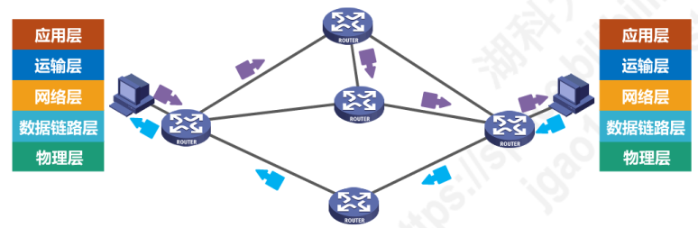

* **面向连接的虚电路服务和无连接的数据报服务对比**
  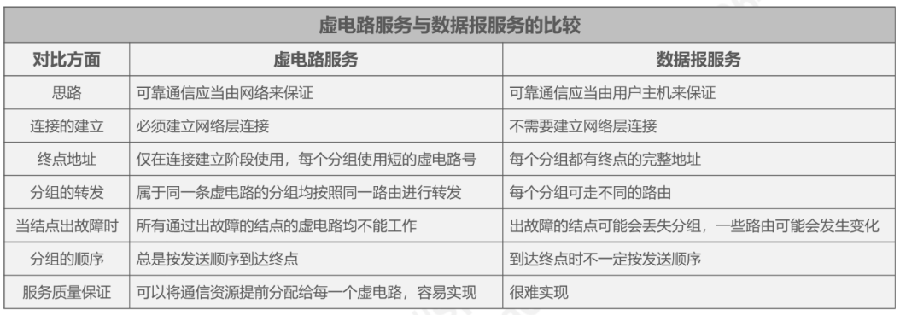

---

# 三、IP协议

## 4.3.1 IPv4地址概述

* **IPv4地址**就是给因特网上的**每一台主机（或路由器)的每一个接口**分配一个在全世界范围内是**唯一的32比特的标识符**
* IPv4地址编址方法经历了3个历史阶段

* 点分十进制表示
 

## 4.3.2 分类编址的IPv4地址

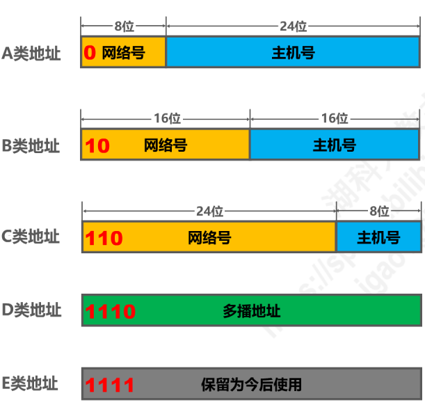
* **注意事项：**
  * 只有A、B和C类地址才能分配给网络中的主机或路由器的各个接口
  * 主机号**全为0**的地址是**网络地址**，不能分配给主机或路由器的各个接口
  * 主机号为**全1**的地址是**广播地址**，不能分配给主机或路由器的各个接口
 

* **A类地址** 
  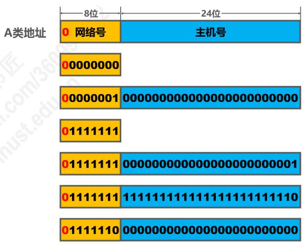
  * 最小网络号为0，保留不指派
  * 最大网络号为127，保留不指派
  * 第一个可指派网络号为1，网络地址为1.0.0.0
  * 最后一个可指派网络号为126，网络地址为126.0.0.0
  * 可指派网络数量为$2^{8-1} - 2 = 126$
  * 每个网络中可分配的IP地址为$2^{24} - 2 = 16777214$
 

* **B类地址**
  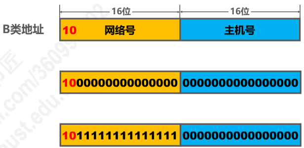
  * 最小网络号也是第一个可指派的网络号**128.0**，网络地址：128.0.0.0
  * 最大网络号也是最后一个可指派的网络号**191.255**，网络地址:191.255.0.0
  * 可指派网络数量为$2^{16 - 2} = 16384$
  * 每个网络总能可分配的IP地址数量为$2^{16} - 2 = 65534$
   

* **C类地址**
  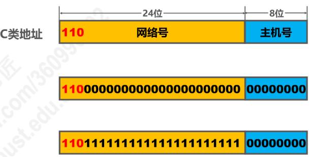
  * 最小网络号，也是第一个可指派网络号**192.0.0**，网络地址为192.0.0.0
  * 最大网络号，也是最后一个可指派网络号**223.255.255**，网络地址为223.255.255.0
  * **可指派网络数量**为$2^{24 - 3} = 2097152$
  * 每个网络中可分配IP地址数量：$2^{8} - 2 = 254$
 

* **总结**
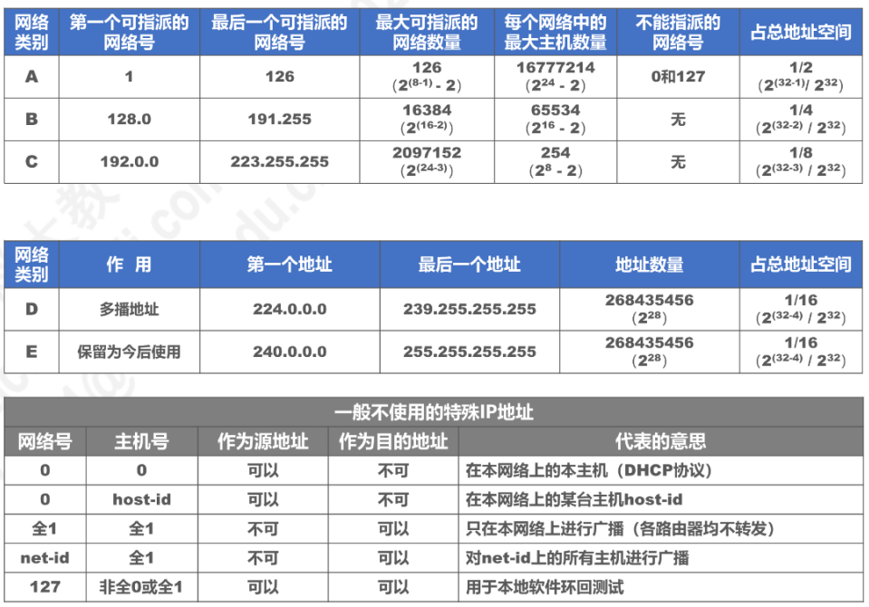

## 4.3.3 划分子网的IPv4地址

* 为新增网络申请新的网络号会带来如下弊端
  * 需要等待时间花费更多费用
  * 增加其他路由器中路由表记录的数量
  * 浪费原有网络号中剩余大量IP地址
 

* **利用子网掩码从主机号部分借用几个比特作为子网号**
 

* **32比特的子网掩码可以表明分类IP地址的主机号被借用了几个比特作为子网号**
  * 子网掩码**使用连续的比特1来对应网络号和子网号**
  * 子网掩码**使用连续的比特0来对应主机号**
  * 将划分子网的**IPv4地址**与其相对应的**子网掩码**进行**与逻辑运算**就可得到IPv4地址**所在子网的网络地址**
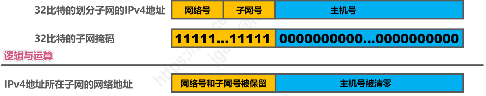
 

* **默认子网掩码**
  * 是在在未划分子网的情况下所使用的子网掩码
  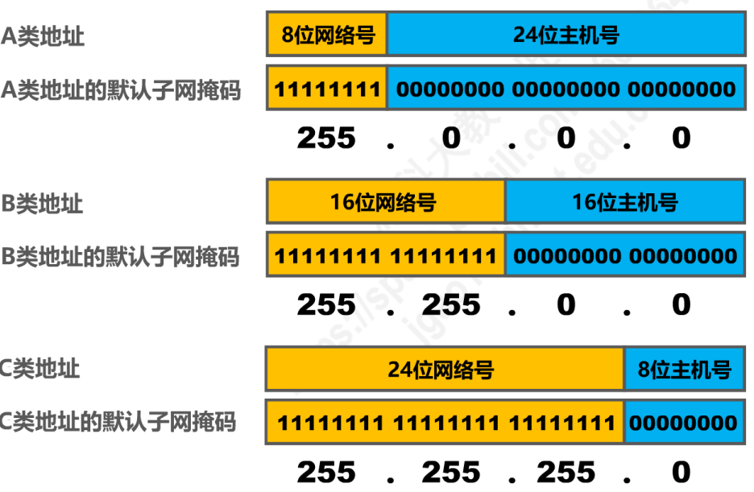
 

* 给定一个分类的IP地址和相应的子网掩码，可确定子网划分细节：
  * 划分**子网数量**
  * 每个子网可分配的**IP地址数量**
  * 每个子网的**网络地址**和**广播地址**
  * 每个子网可分配的**最小和最大地址**
  

## 4.3.4 无分类编址的IPv4地址
* 划分子网在一定程度上缓解了因特网在发展中遇到的困难，但数量巨大的C类网因为其地址空间太小并**没有得到充分利用**
 

* 解决方案：采用**无分类编制**的方法来解决IP地址紧张的问题，同时成立IPv6工作组研究新版本IP彻底解决IP地址耗尽问题
 

* 1993年IETF发布了无分类域间路由选择CIDR(Classless Inter-Domain Routing)
  * CIDR消除了传统的A类、B类和C类地址，以及划分子网的概念
  * CIDR可更加有效的分配IPv4的地址空间
 

* CIDR使用"斜线记法"或称CIDR记法。即在IPv4地址后面加上斜线"/",斜线后为网络前缀所占比特数量
  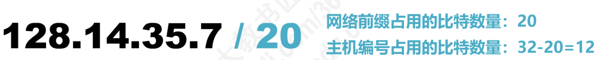
 

* CIDR实际上是将网络前缀都相同的连续的IP地址组成一个"CIDR地址块"
 

* **我们只要知道CIDR的一个地址块，就可以知道该地址块的全部细节：**
  * 地址块的最小地址和最大地址
  * 地址块中的地址数量
  * 地址块聚合某类网络(A类、B类和C类)的数量
  * 地址掩码(也可继续称为子网掩码)
  
   

* **路由聚合(构造超网)：找共同前缀**
  * 网络前缀最长，地址块越小，路由越具体
  * 若路由表查转发分组时发现有多条路由可选，则选择网络前缀最长的那条，称之为最长前缀匹配，因为这样路由更具体
  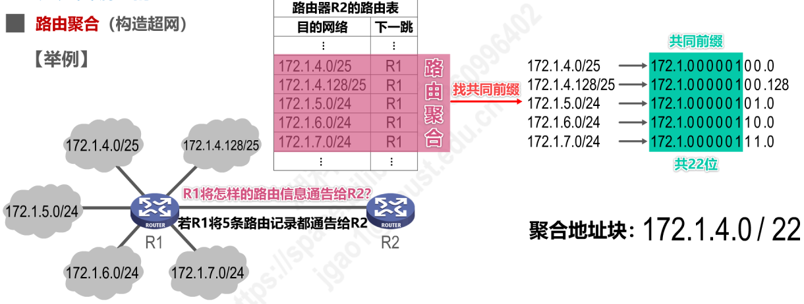

## 4.3.5 IPv4地址的应用规划
* **定长的子网掩码FLSM(Fixed Length Subnet Mask)**
  * 使用同一个子网掩码来划分子网
  * 每个子网所分配的IP地址数量相同，造成IP地址浪费
  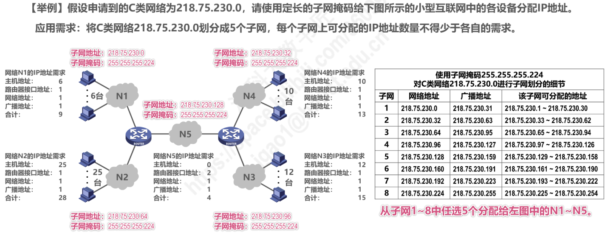
   
* **变长的子网掩码VLSM(Variable Length Subnet Mask)** 
  * 使用不同的子网掩码来划分子网
  * 每个子网所分配的IP地址数量可以不同，尽可能减少IP地址的浪费
  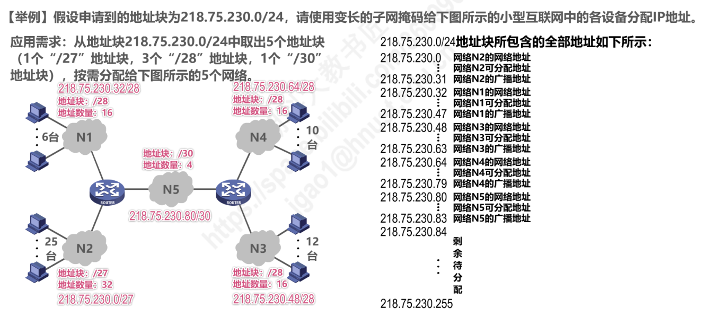
  **注意分配地址块的分配原则是**：每个字块的起点位置不能随意选取，只能选取块大小整数倍的地址作为起点。

---

# 四、IP 数据报的发送和转发过程
* **IP数据报的发送和转发包括：**
  * 主机发送IP数据报
  * 路由器转发IP数据报
 

* **主机发送IP数据报**
  * 源主机判断目的主机是否与自己在同一网络
    * 若在同一个网络，则称之为直接交付
    * 若不在同一个网络，则属于间接交付，传输给主机所在网络的默认网关，由默认网关帮忙转发
  * 如何判断是否在同一网络：目的主机的IP地址与源主机的子网掩码进行与逻辑运算，得到的网络地址如果与源主机的网络地址不相同则不在同一网络
  * 主机如何知道路由器R的存在：将路由器的IP地址设置为默认网关
  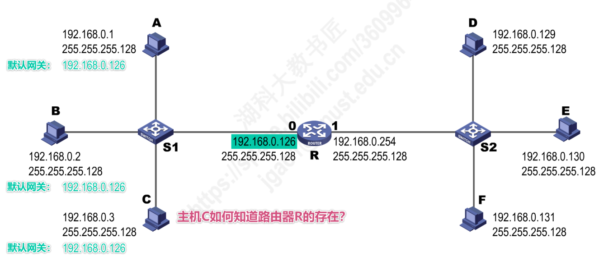
 

* **路由器转发IP数据包**
  * 检查IP数据报首部是否出错
    * 若出错，则直接丢弃该IP数据报并通告源主机
    * 若没出错，则进行转发
  * 根据IP数据报的目的地址在路由表中查找匹配的条目
    * 若找到匹配的条目，则转发给条目中的吓一跳;
    * 若找不到，则丢弃该IP数据报并通告源主机
  * 路由器是隔离广播域的

> * 中继器和集线器工作在物理层，既不隔离冲突域也不隔离广播域
> * 网桥和交换机(多端网桥)工作在数据链路层，可以隔离冲突域，不能隔离广播域
> * 路由器工作在网络层，既隔离冲突域，也隔离广播域

---

# 五、静态路由配置及其可能产生的路由环路问题

* 静态路由配置
  * 指用户或网络管理员使用路由器的相关命令给路由器人工配置路由表
    * 配置方式简单，但不能及时适应网络状态的变化
    * 只在小规模的网络中使用
 

* 使用静态路由配置可能出现以下导致产生路由环路的错误
  * 配置错误
  * 聚合了不存在的网络
  * 网络故障
 

* 路由条目的类型
  * 直连网络
  * 静态路由(人工配置)
  * 动态路由(路由选择协议)
 

* 特殊的静态路由条目
  * 默认路由(目的网络为0.0.0.0,地址掩码为0.0.0.0)
  * 特定主机路由(目的网络为特定主机的IP，地址掩码为255.255.255.255)
  * 黑洞路由(吓一跳为null0)

---

# 六、路由选择协议

## 4.6.1 路由选择协议概念
* 静态路由选择
  
* 动态路由选择
  
* 因特网所选择的路由选择协议的主要特点
  * 自适应：
  * 分布式
  * 分层次
* 路由选择协议
* 路由器的基本结构

## 4.6.2 路由信息协议RIP的基本工作原理

## 4.6.3 开放最短路径优先OSPF的基本工作原理

## 4.6.4 边界网关协议BGP的基本工作原理

--- 

# 七、IPv4数据报的首部格式

--- 

# 八、网际控制报文协议ICMP
* ICMP 差错报文
  * 终点不可达
  * 源点抑制
  * 时间超过
  * 参数问题
  * 改变路由(重定向)

## 4.9 虚拟专用网VPN与网络地址转换NAT

***
