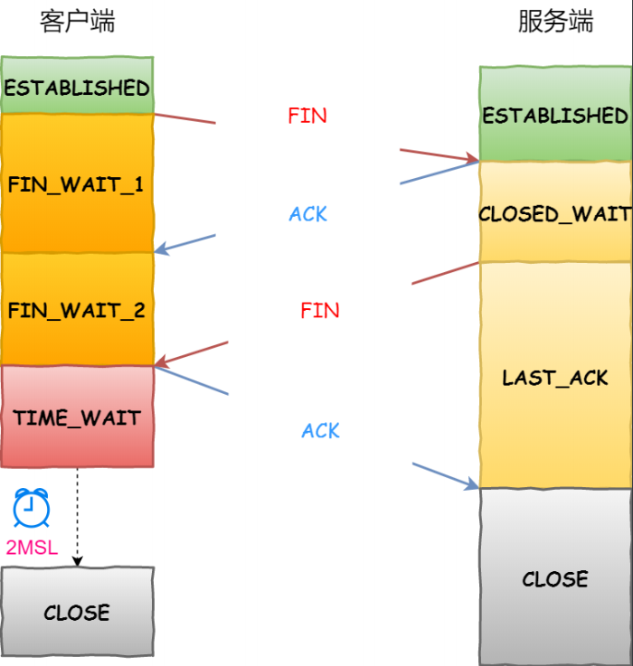

> # 5.传输层

## 5.1 概述

* 计算机网络中物理层、数据链路层以及网路层共同解决了将主机通过异构网络互联起来所面临的问题，实现了主机到主机间的通信
* 实际计算机网络中通信的主体是 位于通信两端主机中的进程。
* 运输层的任务： 为运行在不同主机上的应用进程提供直接的通信服务,因此又称为端到端协议
* 插入PPT图片

## 5.2 运输层端口号、复用与分用的概念

### 5.2.1 运输层端口号

* 运行在计算机上的进程使用进程标识符PID来标识
* 不同的操作系统又使用不同格式的进程标识符
* 为了使不同操作系统间的计算机间的应用进程之间的网络进程能够进行通信，必须使用统一的方法对TCP/IP体系的应用进程进行标识
* TCP/IP体系使用端口号码来区分不同的应用进程
  * 端口号使用16bit表示，取值范围为0～65536
    * 熟知端口号
    * 登记端口号
    * 短暂端口号
  * 端口号只具有本地意义，即端口号只是为了标识本计算机应用中的各进程，在因特网中，不同计算机的相同端口号是没有联系的。

### 5.2.2 发送方的复用和接收方的分用
为什么

### 5.2.3 TCP/IP体系的应用层常用协议所使用的运输层熟知端口号

## 5.3 UDP和TCP的对比
UDP 无连接  TCP 有连接
UDP 支持单播、多播与广播 TCP仅支持单播
UDP 是面向应用报文的，包发送 TCP 面向字节流的，正是TCP实现可靠传输，拥塞控制、流量控制的基础，全双工通信
UDP 无连接不可靠传输服务（适用于实时应用）  TCP 有连接可靠的传输服务，适用于可靠传输应用
UDP 短文首部，8个字节 源端口 目的端口 长度 校验和
TCP 报文首部最小20个字节，最大60个字节

## 5.4 TCP的流量控制

* 流量控制
* 滑动窗口机制

## 5.5 TCP的拥塞控制

* 拥塞

* 四种拥塞控制算法的基本原理，假定如下条件：
  * 1. 数据总是单向传输的，另一方只确认传输
  * 2. 接收方总是有足够大得缓存空间，而发送方发送窗口得大小由网络得拥塞程度来控制
  * 3. 以最大报文段MMS得个数为讨论问题的单位，而非以字节为单位
  
### 5.5.1 慢开始

### 5.5.2 拥塞避免

### 5.5.3 快重传

### 5.5.4 快恢复

## 5.6 TCP超时重传时间的选择

## 5.7 TCP可靠传输的实现

* TCP基于以字节为单位的滑动窗口来实现可靠传输

## 5.8 TCP的运输连接管理

### 5.8.1 TCP的连接建立
* TCP的连接建立要解决一下三个问题
  * 使TCP双方能够确知对方的存在
  * 使TCP双方能够协商参数（如最大窗口值，是否使用窗口扩大选项和时间戳选项以及服务质量)
  * 使TCP双方能够对运输实体资源(如缓存大小、连接表中的项目等)进行分配
* TCP使用"三报文"建立连接
  

* 能否使用"两报文"建立连接

### 5.8.2 TCP的连接释放
* TCP 通过"四报文"来释放连接

* 为什么客户端还要等待2MSL
* TCP中保活计时器的作用
  * 为了发现TCP客户端进程出现故障

## 5.9 TCP报文段的首部格式

***

> # 6. 应用层

## 6.1 应用层概述
* 计算机网络体系结构顶层，是建立和设计计算机网路的最终目的

* 常见应用
  * 万维网
  * 域名DNS
  * 动态主机配置DHCP
  * 电子邮件
  * 文件传送FTP和P2P文件共享
  * 多媒体网路应用

## 6.2 客户-服务器（CS）方式和对等方式（P2P）
### 6.2.1 客户/服务器
* 客户和服务器是指通信中所涉及的两个应用进程
* 客户/服务器方式所描述的是进程间之间服务和被服务的关系
* 客户端是服务请求方，服务器是服务提供方

### 6.2.2 对等方式(Peer to Peer,P2P)方式
* 在P2P方式中，没有固定的服务请求者和服务提供者，分布在网络边缘各端系统中的应用进程是对等，被称为对等方，对等方相互直接通信

## 6.3 动态主机配置DHCP
* DHCP的作用
  * 

* DHCP的工作过程

* DHCP中继代理

## 6.4 域名系统DNS
* DNS的作用

* 域名解析的过程
  * 递归查询
  * 迭代查询
   
  * 高速缓存

## 6.5 文件传输协议FTP
* 文件传输协议(File Transfer Protocol)
  * FTP 提供交互式式的访问，允许客户指明文件的类型和格式，并允许文件具有存取权限
  * FTP屏蔽了计算机系统的细节，因而适合于在异构网络中任何计算机之间传送文件

* FTP的基本工作原理 

## 6.6 电子邮件
* 采用C/S方式

* 电子邮件系统三个组件构成：用户代理，邮件服务器以及电子邮件所需的协议

* SMTP协议

* 邮局协议POP

* 因特网邮件访问协议IAMP

## 6.7 万维网WWW

* 万维网文档

* 超文本传输协议HTTP

* 使用Cookie在服务器上记录用户信息
  * Cookie提供了一种机制使得万维网服务器能够“记住用户"，而无需用户主动提供用户标识信息，即Cookie是一种对无状态HTTP进行状态化的技术

* 万维网缓存与代理服务器

***

# 1.HTTP

## 1.1常见面试题 

### **HTTP基本概念**

* 定义：HTTP 全称是超文本传输协议(HyperText Transfer Protocol).HTTP是计算机网络中两点之间传输文字、图片、视频、音频等超文本数据的约定和规范。
  
* HTTP状态码
  
> * 1xx:表示目前是协议处理的中间状态，还需要后续操作
> * 2XX:成功，报文已收到并被正确处理
> * 3xx:重定向，资源位置发生变动，需要客户端重发请求
> * 4xx:客户端错误，请求报文有误，服务器无法处理
> * 5xx:服务器端错误，服务器在处理请求时内部发生了错误

### **GET与POST**

* Get ⽅法的含义是请求从服务器获取资源，这个资源可以是静态的⽂本、⻚⾯、图⽚视频等。
* POST 向 URI 指定的资源提交数据，数据就放在报⽂的 body ⾥
* GET 方法是安全且幂等的，POST方法不是安全不幂等的
* 安全指服务器安全，幂等指多次提交会创建多个数据

### **HTTP（HTTP 1.1）特点**

* 优点：
  
  * 简单：报文格式header + body，头部信息也是key-value
  * 灵活易于扩展：协议中请求方法、URL、状态码等每个组成都可以自定义和扩充
  * 应用广泛和跨平台
  
* 缺点：
  * 无状态双刃剑，解决无状态方案-cookie
  * 明文传输双刃剑
  * 不安全：明文传输，遭遇伪装，篡改
* HTTP1.1 性能
  * 长连接
  * 采用管道网络传输
  * 队列头阻塞
  
### **HTTP与HTTPS**

* 二者区别
  * HTTP指超文本传输协议，信息是明文传输的，存在安全风险；HTTPS解决HTTP不安全的缺陷，在TCP与HTTP之间加入了TLS安全协议
  * HTTP在TCP三次握手之后便可进行数据传输，HTTPS则是在TCP三次握手之后还需要进行SSL和TSL握手才能进行加密报文传输
  * 端口号，HTTP 80 HTTPS 443
  * HTTPS协议需要向CA进行身份认证
* HTTPS解决了哪些问题
  * 篡改、窃听、冒充
* HTTPS如何解决
  * 混合加密，非对称加密（会话密钥）对称加密（会话密钥）
  * 摘要算法
  * 数字证书
* SSL/TLS四次握手
  * Client hello，客户端向服务器发送请求（版本，随机数，密码套件)
  * Server hello，服务器向客户端响应(版本，随机数，密码套件，服务证书)
  * 客户端回应（随机数，加密通信算法变更通知，客户端握手结束通知）
  * 服务器最后回应（加密算法变更通知，握手结束通知)
  
### **HTTP1.1，HTTP2 HTTP3**

* HTPP1.1 相比于HTTP1.0
  * 长连接、支持管道
* HTTP2 相比于HTTP1.1
  * 头部压缩
  * 二进制格式
  * 数据流
  * 多路复用
  * 服务器推送
* HTTP3 将传输层的协议由TCP改为UDP 
       
## 1.2 HTTP1.1如何优化

* 通过缓存，来避免发送请求
* 减少HTTP请求的次数
  * 将重定向交给代理服务器
  * 小资源合并为大资源
  * 按需访问资源，只访问用户当前用得到的资源
* 压缩资源

## 1.3 HTTP RSA握手解析
* TLS握手过程
    * client hello:版本号，随机数，密码套件
    * server hello：版本号，随机数，密码套件，身份证书
    * 客户端响应：随机数，加密算法变更通知，客户端握手结束通知
    * 服务器响应：加密算法变更通知，服务器握手结束通知
* RSA握手过程

* RSA缺陷
    * 不支持前向保密，解决方案DH密钥协商算法

## 1.4 HTTPS ECDHE握手解析
HTTP常用的两种加密算法RSA算法与ECDHE算法
### 离散对数
* ECDHE算法是有DH算法演化而来，而DH是非对称加密算法，其核心是离散对数

### DH算法
* 双方各自保存私钥，利用离散对数算出双方公钥
* 双方利用公开的私钥计算出对称加密密钥
### DHE算法
* 私钥的生成方式，DH算法实现有两种
    * static DH算法，不具备前向安全性，废弃
    * DHE算法，E全称是ephemeral(临时性的)，表示服务器与客户端的私钥在每次密钥交换时，都时随机生成的临时的
### ECDHE算法
* 由于DFE算法性能不佳，因此出现了ECDHE算法
* 密钥交换过程
    * 双方首先确定好使用的椭圆曲线与曲线上的基点G
    * 双方各自生成随机数作为私钥d，并得到公钥Q = dG
    * 双方交换各自公钥，分别计算d1Q2=d1d2G = d2d1G = d2Q1。为共享密钥

## 1.5 HTTPS如何优化
### 硬件优化
因为HTTPS是计算密集型，因此应该选择强力CPU，最好选择支持AES-NI特性的CPU，该特性可在硬件级别优化AES对称加密算法
### 软件优化
* 软件升级为比较新的版本如Linux内核2.X升级为4.X
* 协议优化
    * 密钥交换使用ECDHE算法，而非RSA算法，前向加密且客户端三次握手之后，就可以发送加密应用数据
    * TSL1.2升级为TSL 1.3
* 证书优化
    * 服务器选用ECDSA证书，而非RSA证书
    * 服务器应开启OCSP stapling 功能
* 会话复用
    * Session ID:客户端和服务器⾸次 TLS 握⼿连接后，双⽅会在内存缓存会话密钥，并⽤唯⼀的Session ID 来标识， Session ID 和会话密钥相当于 key-value 的关系。
    * Session Ticket：服务器不在缓存每个客户端的会话密钥，而是将缓存工作交给客户端。首次连接后服务器将Ticket发给客户端，客户端进行缓存，客户端再次连接服务器时，客户端会发送Ticket，服务器解密后，获取上次会话密钥，验证有效期，就可以恢复会话，开始加密通信。
    * Pre-shared Key
## 1.6 HTTP2牛逼在哪儿？
* 兼容HTTP1.1
* 对头压缩，通过静态表和Huffman编码
* 二进制帧
* 并发传输
* 服务器主动推送资源：客户端请求从服务器获取HTML文件，后续需要CSS进行渲染时，对HTTP1.1客户端还需要再发起获取CSS文件的请求，而对HTTP2服务器会主动推送CSS
## 1.7 HTTP3强势来袭
* HTTP/2虽然具有多个流并发传输的能力，但传输层是TCP协议，于是存在如下缺陷：
    * 队头阻塞
    * TCP和TLS握手延时
    * 连接迁移需要重新连接
* HTTP3将传输层从TCP换成UDP，并在UDP协议上开发了QUIC协议来保证数据可靠传输

* QUIC协议特点
    * 无对头阻塞
    * 建立连接速度快
    * 连接迁移
* 另外HTTP3 的QPACK通过两个特殊的单向流来同步双方动态表，解决了HTTP2的HPACK队头阻塞问题。
# 2.TCP
## 基础知识
* TCP是面向连接的、可靠的、基于字节流的传输层通信协议
* TCP连接是需要客户端与服务器端达成三个信息的共识：
    * Socket：由IP地址和端口号组成
    * 序列号：用来解决乱序问题
    * 窗口大小：用来做流量控制
* TCP与UDP的区别
    * 连接：TCP是面向连接的，UDP不需要连接即刻传输数据
    * 服务对象：TCP是1对1两点服务；UDP支持1对1、1对多、多对多
    * 可靠性
    * 拥塞控制与流量控制
    * 首部开销：TCP首部开销可变，UDP首部开销不变
    * 传输方式：TCP是流式传输，没有边界；UDP是包传输，可能丢包或者乱序
    * 分片不同
    * 应用场景
        * TCP经常用于FTP文件传输、HTTP、HTTPS传输
        * UDP用于包总量较少的通信，如DNS 视频、音频等

## TCP 连接三次握手
* 控制位：
    * ACK：该位为1时，确认应答
    * RST：该位为1时，TCP连接异常必须强制断开
    * SYN：该位为1时，希望建立连接，并在其序列号的字段进行序列号的初始值的设定
    * FIN：该位为1时，表示希望断开连接 
* 连接过程

    * 刚开始客户端与服务器都会处于关闭状态，服务器处于监听状态等待客户端连接
    * 客户端将SYN=1，并随机初始化序列号seq_number将SYN报文发送给服务器
    * 服务器返回 SYN + ACK,ACK_num,seq_number
    * 客户端返回ACK ACK_nunmber + 1
* 为什么需要进行三次握手
    * 三次握手才能阻止重复历史连接的初始化
    * 三次握手双反才能同步双方序列号
    * 三次握手才可以避免资源浪费
* 不使用两次握手和四次握手的原因
    * 不使用两次握手时，无法防止历史连接的建立，也无法可靠的同步双方序列号
    * 三次握手就已经是理论上最少可靠连接建立，所以不需要更多的通信次数
* 为什么客户端和服务器端初始序列号ISN不相同
    * 分别新报文还是历史报文，如果ISN相同则旧连接的历史报文还留在网络中，此时会出现数据错乱
    * 防止黑客伪造相同的序列号TCP报文被对方接收
* SYN攻击
    * 假设攻击者短时间伪造不同 IP 地址的 SYN 报⽂，服务端每接收到⼀个 SYN 报⽂，就进⼊ SYN_RCVD 状态，但服务端发送出去的 ACK + SYN 报⽂，⽆法得到未知 IP 主机的 ACK 应答，久⽽久之就会占满服务端的 SYN 接收队列（未连接队列） ，使得服务器不能为正常⽤户服务。
    * 避免攻击方式1：修改Linux内核参数
    * 避免攻击方式2：tcp_syncookies的方式可以应对SYN攻击
## TCP 断开四次挥手
* 断开过程

    * 客户端发送FIN报文，请求断开连接
    * 服务器返回ACK报文，确认收到断开连接请求
    * 服务器等待当前数据发送完成后，返回FIN报文，请求断开连接
    * 客户端收到服务器端的FIN报文后，返回ACK报文
    * 注意主动关闭连接的才有TIME_WAIT状态

* 为什么需要四次挥手？/
    服务端通常需要等待完成数据的发送和处理，所以服务端的 ACK 和 FIN ⼀般都会分开发送，从⽽⽐三次握⼿导致多了⼀次。
* 为什么TIME_WAIT等待时间是2MSL？
    * MSL报文最大生存时间，
    * 2倍的最大生存时间，比较合理的解释是：⽹络中可能存在来⾃发送⽅的数据包，当这些发送⽅的数据包
被接收⽅处理后⼜会向对⽅发送响应，所以⼀来⼀回需要等待 2 倍的时间。

## TCP重传、滑动窗口、流量控制、拥塞控制
### TCP重传
* 超时重传
* 快速重传
* SACK：选择性确认机制，将魂村的地图发送给发送方，发送方根据地图只重传丢失的数据
* D-SACK(Duplicate)：主要使⽤了 SACK 来告诉「发送⽅」有哪些数据被重复接收了。
### 滑动窗口
* 接收端告诉发送端，自己还有多少缓冲区可以接收数据，于是发送端就可以根据这个接收端的处理能⼒来发送数据，⽽不会导致接收端处理不过来。
### 流量控制
* TCP 提供⼀种机制可以让「发送⽅」根据「接收⽅」的实际接收能⼒控制发送的数据量，这就是所谓的流量控制。
### 拥塞控制
* 拥塞控制，控制的⽬的就是避免「发送⽅」的数据填满整个⽹络。
* 慢启动、拥塞避免、拥塞发生、快速恢复
# 3.IP
## 3.1 IP地址基本认识
* IP作用：IP处于TCP/IP模型中的第三层，也就是网络层。网络层的主要作用是：实现主机与主机之间的通信，也叫点对点通信。
* IP与MAC的区别：IP实现没有直连的两个设备之间的通信，MAC实现两个直连设备之间的通信。
* IP地址的分类：分为A、B、C、D、E
    * A、B、C类分为网络号与主机号
    * D类没有主机号，一般用来多播。多播⽤于将包发送给特定组内的所有主机。
    * E类地址预留使用
* 无分类地址CIDR
    *  32 ⽐特的 IP 地址被划分为两部分，前⾯是⽹络号，后⾯是主机号。
    * 表示形式 a.b.c.d/x ，其中 /x 表示前 x 位属于⽹络号， x 的范围是 0 ~ 32 ，这就使得 IP 地址更加具有灵活性。
    * 还有一种表示形式是利用子网掩码进行划分，掩码的意思是掩盖掉主机号，剩余的就是网络号
* IPV6 与IPV4
    * IPV4是32位，IPV6是128位   

## IP协议相关技术
* DNS域名解析
* ARP协议是已知 IP 地址求 MAC 地址，那 RARP 协议正好相反，它是已知 MAC 地址求 IP 地址。
* DHCP，动态获取IP地址
* NAT网络地址转换方法
* ICMP：互联⽹控制报⽂协议，ICMP 主要的功能包括： 确认 IP 包是否成功送达⽬标地址、报告发送过程中 IP 包被废弃的原因和改善⽹络设置等。

## ping工作原理
* IP协议助手-ICMP协议，ping是基于ICMP协议工作的
