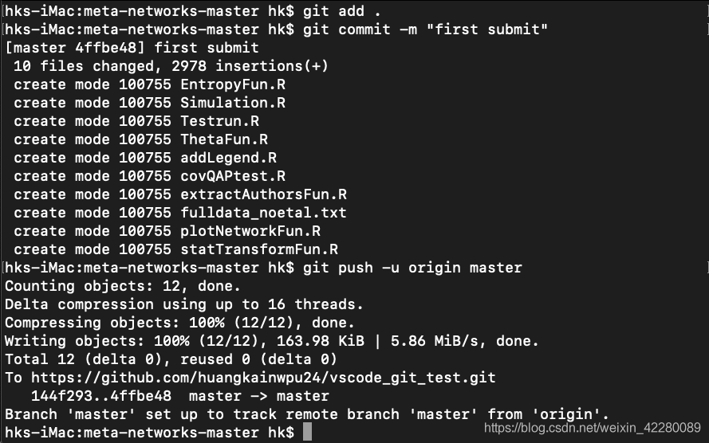

# MAC配置Github

+ 基本信息
  + 操作系统版本：Mac Monterey 12.1
  + git版本:
  + vscode版本：
  
+ 步骤
  + github创建仓库


  + 本地git初始化及终端命令进行同步
  
    + 1. git全局设置,打开终端，输入如下命令
  
        ```
        git config --global user.name "xxxx"
        git config --global user.email "xxxx@xx.com"
        ```

    + 2. 配置专属SSH Key
      + 终端输入如下命令
  
        ```
        ssh-keygen -t rsa -C "xxxx@xx.com"
        ```

        ```
        运行过程如果出现如下报错：

          Saving key "//.ssh/id_rsa" failed: No such file or directory

        解决方案：输入如下指令

          ssh-keygen -t rsa -b 4096 -C "my@emailaddress.com" -f /path/to/key
        ```

      + 回车后会打开id_rsa.pub文件，之后拷贝里面的所有内容。
        ```
            vim ~/.ssh/id_rsa.pub
        ```

      + 进入github主页——Settings——SSH and GPG keys——New SSH key，将之前复制的拷贝到Key栏目，Title栏目可以随意命名，之后点击ADD SSH key即可。

  +  验证连接终端输入如下指令
      ```
      ssh -T git@github.com
      ```
      如果输出如下内容则代表成功
        ```
        Hi github username! You've successfully authenticated, but GitHub does not provide shell access.
        ```
  + 文件同步
    + 进入到之前在github创建的仓库，拷贝HTTPS的URL
    + 在本地需要上传项目的文件夹内打开终端。输入如下命令
      ```
      git init
      ```
    + 输出如下内容则表示成功
      ```
      Initialized empty Git repository in /Users/hk/Documents/project/small sample detection/Meta Networks/meta-networks-master/.git/
      ```
    + 输入如下命令添加远程连接地址，其中URL地址为之前拷贝的仓库地址（需与自己创建的一致).
      ```
      git remote add origin https://github.com/huangkainwpu24/vscode_git_test.git
      ```
    + 再把远程仓库的文件pull到本地项目文件夹中（即使远程仓库中只有README也需要pull，否则会报错）由于github将密码换成token，输入git pull origin master
      会出现如下提示：
      ```
      remote: Support for password authentication was removed on August 13, 2021. Please use a personal access token instead.
      ```
      因此需要配置token并使用如下指令完成此步骤：

      '''
      git remote set-url origin https://<your_token>@github.com/<USERNAME>/<REPO>.git
      <your_token>：换成你自己得到的token
      <USERNAME>：是你自己github的用户名
      <REPO>：是你的仓库名称
      '''

      token配置教程链接：https://blog.csdn.net/weixin_41010198/article/details/119698015

      + 之后就可以将需要同步的文件上传到github仓库中去
        ```
        git add . //add后面跟"."表明添加所有文件，如果只需要添加个别文件直接后面跟文件名，也可后面跟多个文件名
        git commit -m "first submit" //注释说明，每次提交新文件或更改的文件都需要添加注释
        git push -u origin master //将add的文件push到github仓库中去
        ```
        终端有如下输出，则说明上传成功。
        

        


