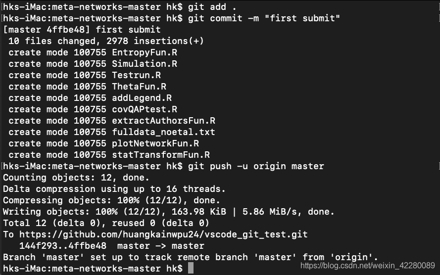

# 操作手册

## Github

> github create a new repository on the command line

```bash
echo "# Building" >> README.md
git init
git add README.md
git commit -m "first commit"
git branch -M main
git remote add origin https://github.com/manjixx/Building.git
git push -u origin main
```

> github push an existing repository from the command line

```bash
git remote add origin https://github.com/manjixx/Building.git
git branch -M main
git push -u origin main
```

> Error

```bash
fatal: unable to access 'https://github.com/manjixx/Building.git/': HTTP/2 stream 1 was not closed cleanly before end of the underlying stream
(base) iiixv@IIIXVdeAir Building % git config --global http.version HTTP/1.1
```

> git push 错误

```bash
 LibreSSL SSL_read: error:02FFF03C:system library:func(4095):Operation timed out, errno 60
```

## MacOS 安装 Centos虚拟机

### 基本配置

- MacBook Air (M1, 2020)
- 操作系统: Mac OS Monterey 12.4
- 虚拟机：VMware Fusion 专业版 e.x.p (19431034),官网目前可白嫖
  
  下载链接：[M1版本VMware Fusion](https://customerconnect.vmware.com/downloads/get-download?downloadGroup=FUS-PUBTP-2021H1)

### Centos 8 安装包下载

- 下载CentOS 8安装包，注意Centos 7 貌似无法在Mac M1上进行安装,系统提示架构问题
- [Centos 8 百度网盘](https://pan.baidu.com/s/1xSQ8ykESVOPTwBJ5c8xFDQ?pwd=kyqb) 提取码:kyqb

### Centos 8 安装

参考下列文章完成系统安装与配置

[Centos 8安装教程](https://blog.csdn.net/qq_42778369/article/details/123093854)

[Centos 8安装，配置以及开启SSH](https://blog.csdn.net/qq_24950043/article/details/122517521?spm=1001.2101.3001.6661.1&utm_medium=distribute.pc_relevant_t0.none-task-blog-2%7Edefault%7ECTRLIST%7ERate-1-122517521-blog-123093854.pc_relevant_antiscanv2&depth_1-utm_source=distribute.pc_relevant_t0.none-task-blog-2%7Edefault%7ECTRLIST%7ERate-1-122517521-blog-123093854.pc_relevant_antiscanv2&utm_relevant_index=1)

[Centos 8配置阿里镜像源](https://blog.csdn.net/xiaocao_debug/article/details/123041407)

## MacOS 安装 Ubuntu虚拟机

### 系统配置

- MacBook Air (M1, 2020)
- 操作系统: Mac OS Monterey 13.1
- 虚拟机：VMware Fusion 专业版 e.x.p (19431034),官网目前可白嫖

### 下载VMware

下载链接：[M1版本VMware Fusion 21H1](https://customerconnect.vmware.com/downloads/get-download?downloadGroup=FUS-PUBTP-2021H1)
下载链接：[M1版本VMware Fusion 22H2](https://customerconnect.vmware.com/cn/downloads/get-download?downloadGroup=FUS-PUBTP-22H2)

### Ubuntu 20.04 下载

下载链接：[Ubuntu 20.04](http://old-releases.ubuntu.com/releases/20.04/ubuntu-20.04-live-server-arm64.iso) 

### Ubuntu 20.04 安装

参考博客[mac pro M1(ARM)安装：ubuntu虚拟机（四）](https://blog.csdn.net/qq_24950043/article/details/123764210)

### 问题

重新启动虚拟机时，会在如下界面卡死


> **解决方案如下**

- 进入GNU grub界面，进入Advanced options for Ubuntu, 选择低版本内核启动
- 进入Ubuntu系统，打开终端，输入`sudo vi /etc/default/grub`, 把其中的`GRUB_DEFAULT=0` 改为 `GRUB_DEFAULT=“1>2"`（注意，其中的数字表示图中红色数字所标的序号，1表示启动时先进入`Advanced options for Ubuntu`， 2表示选择第3个内核启动。自然地，如果你要选择第4个内核启动，则`GRUB_DEFAULT=“1>3"`）。保存后回到终端


- 在终端输入 `update-grub`

> **相关操作**

- 查看当前内核版本号

```bash
uname -r
uname -a
```

- 筛选当前已安装的内核

```bash
sudo dpkg --get-selections | grep linux-image
```

- 选择自己保留不升级的内核

```bash
sudo apt-mark hold kernel name
```

## 详见MAC配置git与文件同步

> **系统信息**

- 操作系统版本：Mac Monterey 12.1
- git版本:
- vscode版本：
  
> **步骤**

- github创建仓库

- 本地git初始化及终端命令进行同步  
  - 1. git全局设置,打开终端，输入如下命令

    ```bash
    git config --global user.name "xxxx"
    git config --global user.email "xxxx@xx.com"
    ```

  - 2. 配置专属SSH Key
    - 终端输入如下命令
  
    ```bash
    ssh-keygen -t rsa -C "xxxx@xx.com"
    ```

    - 运行过程如果出现如下报错：

    ```bash
    Saving key "//.ssh/id_rsa" failed: No such file or directory
    ```

    - 解决方案：输入如下指令

    ```bash
    ssh-keygen -t rsa -b 4096 -C "my@emailaddress.com" -f /path/to/key
    ```

    - 回车后会打开id_rsa.pub文件，之后拷贝里面的所有内容。

    ```bash
        vim ~/.ssh/id_rsa.pub
    ```

    - 进入github主页——Settings——SSH and GPG keys——New SSH key，将之前复制的拷贝到Key栏目，Title栏目可以随意命名，之后点击ADD SSH key即可。

  - 3. 验证连接终端输入如下指令

    ```bash
    ssh -T git@github.com
    ```

    如果输出如下内容则代表成功

    ```bash
    Hi github username! You've successfully authenticated, but GitHub does not provide shell access.
    ```

- 文件同步
  - 进入到之前在github创建的仓库，拷贝HTTPS的URL
  - 在本地需要上传项目的文件夹内打开终端。输入如下命令

    ```bash
    git init
    ```

    - 输出如下内容则表示成功

      ```bash
      Initialized empty Git repository in /Users/hk/Documents/project/small sample detection/Meta Networks/meta-networks-master/.git/
      ```

    - 输入如下命令添加远程连接地址，其中URL地址为之前拷贝的仓库地址（需与自己创建的一致).

      ```bash
      git remote add origin https://github.com/huangkainwpu24/vscode_git_test.git
      ```

    - 再把远程仓库的文件pull到本地项目文件夹中（即使远程仓库中只有README也需要pull，否则会报错）由于github将密码换成token，输入`git pull origin master`会出现如下提示：

      ```bash
      remote: Support for password authentication was removed on August 13, 2021. Please use a personal access token instead.
      ```

      因此需要配置token并使用如下指令完成此步骤：

      ```bash
      git remote set-url origin <<<https://<your_token>@github.com/>>><USERNAME>/<REPO>.git
      <your_token>：换成你自己得到的token
      <USERNAME>：是你自己github的用户名
      <REPO>：是你的仓库名称
      ```

      token配置教程链接：<https://blog.csdn.net/weixin_41010198/article/details/119698015>

- 之后就可以将需要同步的文件上传到github仓库中去

    ```bash
    git add . //add后面跟"."表明添加所有文件，如果只需要添加个别文件直接后面跟文件名，也可后面跟多个文件名
    git commit -m "first submit" //注释说明，每次提交新文件或更改的文件都需要添加注释
    git push -u origin master //将add的文件push到github仓库中去
    ```

    终端有如下输出，则说明上传成功。
    

## 利用Vscode同步github

- 首先需要对本地项目文件夹进行配置：详见MAC配置git与文件同步

- 使用Vscode打开该文件夹

- 点击右侧功能栏——源代码管理：此处进行项目文件同步的地方，如果没有对文件进行修改或者添加删除，则不会显示需要进行同步的文件。

- 修改后的文件，则会显示在源代码管理界面
  
  

- 点击图中红框所指的加号，其作用类似于上述终端输入git add filename
  

- 之后点击左边箭头所指的确认勾，就会在右边箭头所指的地方让你添加修改的注释，添加后回车
  

- 这时可以看到vscode最下方状态栏有一个待上传的任务，点击确认勾右边的三点标号，选择推送即可。再次刷新项目仓库网站，就可以看到修改后的同步文件了。
  
