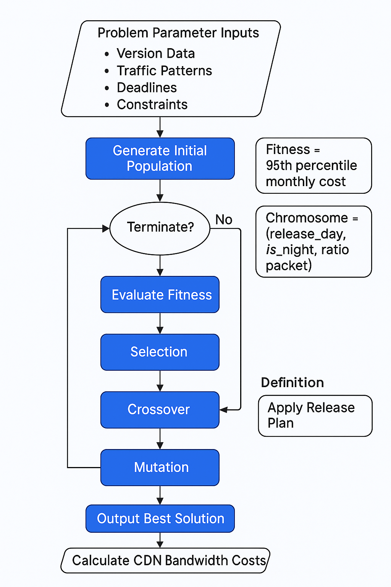

好的，以下是根据你的要求撰写的详细且分层次面向不同读者的说明文档，内容会比较长。我会分多次输出，保持连贯。

⸻

带宽优化遗传算法项目说明文档

一、项目概述

本项目旨在通过遗传算法（Genetic Algorithm, GA）优化手机软件版本包升级的发布时间和分发比例，以此降低CDN带宽费用。

在实际应用中，手机厂商经常需要向大量用户推送软件更新。由于CDN流量计费通常采用“95峰值计费”方式（即取一个月内流量使用的最高5%的小时平均值），因此合理安排版本的发布计划，避免高峰叠加，可以显著降低流量费用。

⸻

二、代码功能总览

模块	功能简介
系统配置	定义基本参数（时间、夜间时段、周末天等）。
版本数据类	建模每个软件版本的大小、用户量、发布时间、流量分布模式。
成本计算引擎	模拟给定发布计划下的小时级带宽使用情况，并计算95峰值费用。
染色体结构	定义一个遗传算法染色体，表示一个版本发布计划。
遗传算法核心引擎	实现遗传算法，包括初始化种群、选择、交叉、变异、评估和进化。
结果可视化工具	将原始发布方案与优化后方案的带宽曲线进行绘图比较。
主程序	调用引擎进行优化，并展示优化效果。


⸻

三、面向小白的详细解释

1. 为什么要优化？

CDN（内容分发网络）按照”95峰值”来收费。比如，你一个月有720小时，它只收你流量用得最多的5%那36小时的费用。如果在某些时间段所有版本一起推送，流量爆了，费用就很高。
所以我们希望把这些版本发布安排得更均匀一点，既不会延迟太久，也能避开高峰，省下很多钱。

⸻

2. 什么是遗传算法？

遗传算法（Genetic Algorithm, GA）是模仿自然界生物进化过程的一种方法，基本步骤包括：
	•	初代种群：随机生成一堆解决方案。
	•	适者生存：评价谁的方案更好（谁更省钱）。
	•	优胜者繁殖：好的方案互相结合（交叉）产生新方案。
	•	随机变化：偶尔随机微调一下（变异）避免陷入死路。
	•	迭代优化：经过一代一代的演化，找到越来越好的答案。

⸻

3. 每一个”方案”是啥？

在本项目中，一个方案（染色体）是针对每个版本的数据：
	•	选哪一天发布（可以选预设时间到截止时间之间的某一天，不能选周末）。
	•	选白天还是夜间发布。
	•	选发布比例（不一定一次推完，比如只推70%用户）。

⸻

4. 程序具体怎么做的？
	•	预设了5个版本，每个版本的大小、用户数量、推送流量的时间分布曲线都不一样。
	•	先随机生成很多种可能的发布安排。
	•	通过模拟每种安排，计算每小时的总带宽消耗，再算出95峰值费用。
	•	保留表现最好的方案，把它们交叉、变异产生新一代。
	•	循环进行300代。
	•	最后找出一个最优的发布安排，带宽费用比最开始的暴力发布低很多。

⸻

5. 成本是怎么计算的？
	•	先根据发布安排算出每小时的带宽使用情况。
	•	夜间流量折半（因为晚上便宜）。
	•	排序找出最大5%的小时，取最高那部分的平均值。
	•	费用 = 峰值 × 720小时。

⸻

四、面向专业人士的完整讲解

1. 系统参数设置
	•	基准日期：2024年5月1日。
	•	月份天数：30天。
	•	夜间定义：00:00 - 08:00。
	•	不可选日（周末）：每周一固定天数列表。

所有日期时间均基于此基准进行天数偏移，保证统一标准。

⸻

2. 数据建模（Version 类）

每个版本包含：
	•	size_gb：每个用户需要下载的数据大小。
	•	users：参与升级的用户总数。
	•	traffic_pattern：每天推送后未来几天内流量分布占比数组。
	•	preset_time：默认的计划发布时间。
	•	deadline：最迟发布完成时间。

这些数据决定了每个版本的可能发布时间窗口和推送压力。

⸻

3. 成本计算器（CostCalculator 类）

核心逻辑：
	•	流量叠加：将所有版本的每日流量加到对应小时上。
	•	夜间折半：夜间时段流量计价降低一半。
	•	费用计算：取排序后前5%小时的平均带宽作为费用基础，乘720小时。

支持两种模式：
	•	计算一个具体计划的费用。
	•	返回每小时带宽数据用于可视化。

⸻

4. 染色体与基因编码（Chromosome）

每一个染色体（Chromosome）包含5个基因，每个基因对应一个版本的发布策略：
	•	(release_day, is_night, ratio)
	•	release_day：实际发布的天数偏移。
	•	is_night：是否选择夜间发布。
	•	ratio：该版本一次发布的用户比例（范围0.1-1.0）。

适应度（fitness）即对应方案的费用。

⸻

5. 遗传算法引擎（GAEngine）

遗传过程细节：

初始化种群
	•	随机为每个版本选择合法的发布日（不在周末）。
	•	随机选择夜间/白天。
	•	随机选择初始发布比例。

选择（Selection）
	•	精英保留制：前15%直接带入下一代。
	•	轮盘赌选择（Roulette Wheel）：按适应度反比例抽取父代。

交叉（Crossover）
	•	单点交叉（Single Point Crossover）：
	•	随机一个交叉点，前部分基因来自父亲，后部分来自母亲。

变异（Mutation）
	•	每个基因以25%概率变异：
	•	可能调整发布天数（重新抽取一个非周末日）。
	•	可能翻转是否夜间发布。
	•	可能微调发布比例（±0.15范围内波动）。

评估（Evaluation）
	•	每次变异后重新计算适应度（费用）。

进化过程
	•	总代数为300代。
	•	每一代输出当前最优个体。

⸻

6. 结果展示与对比（print_comparison）
	•	画出：
	•	原始发布策略下的小时级带宽曲线。
	•	优化后发布策略下的小时级带宽曲线。
	•	额外画出原始与优化方案的95峰值水平线。
	•	直观展示带宽峰值下降效果。

当然可以！这里是接续的详细说明文档（上文已覆盖了第一部分：概览、功能流程、各模块解释、遗传算法细节）。现在继续输出后半部分内容，承接前文：

⸻

五、专业角度深入剖析

为了更好地面向专业人士，下面将以更严谨、专业的方式分析本代码的关键点。

5.1 适用场景与实际意义
	•	应用背景：在大规模软件升级（如手机OTA升级、应用推送）场景下，流量费用通常采用95计费模式，即按照一个月中每5分钟流量峰值的第95百分位来计费。合理地安排发布时间和推送比例，可以有效地降低CDN带宽成本。
	•	实际挑战：
	•	各版本发布时间不同，且有最晚发布期限。
	•	周末禁发或者减少发版。
	•	夜间发布更便宜，但影响用户体验。
	•	发布比例（ratio）可以小于1，意味着流量分阶段释放。
	•	需要兼顾流量分布（traffic_pattern）及版本大小与用户数差异。

此代码基于以上约束条件，设计了一个遗传算法优化框架，在有限时间和计算资源下，找到一个尽量低95峰值的版本发布策略。

⸻

5.2 成本函数设计（CostCalculator）
	•	本质：将一组版本的发版计划映射成一个长度为 30天×24小时 = 720 的时间序列（带宽曲线）。
	•	逻辑细节：
	•	每个版本按照 traffic_pattern 在后续几天分摊流量。
	•	流量在发布当天只占一个小时，后续按全天均匀分布。
	•	夜间带宽费用便宜，设定为白天带宽的一半（通过night_mask实现）。
	•	95计费模拟：
	•	将小时带宽按单价加权（夜间便宜），排降序。
	•	取出前5%以外的最大值，作为计费带宽（大致对应np.percentile(…, 95)操作）。

这保证了评估函数既简洁又合理，适合遗传算法快速迭代。

⸻

5.3 遗传算法核心流程（GAEngine）
	•	初始种群（Population）：
	•	随机为每个版本生成 (发布日, 夜间否, 发布比例)。
	•	避开周末。
	•	发布比例限制在[MIN_RATIO, 1.0]之间。
	•	适应度评估（Fitness）：
	•	每条染色体代表一组完整的发布计划。
	•	使用CostCalculator生成带宽曲线，计算95计费峰值。
	•	适应度即为费用（数值越小越好）。
	•	选择策略：
	•	精英保留（Elitism）：每代保留最优秀的15%个体，防止好解丢失。
	•	轮盘赌选择（Roulette Wheel Selection）：根据适应度倒数加权，偏向于选择好个体交叉。
	•	交叉（Crossover）：
	•	单点交叉，即在基因序列中随机选一个切割点，左边来自父亲，右边来自母亲。
	•	变异（Mutation）：
	•	每个基因（单个版本的策略）有25%的概率发生微小变化：
	•	发布日微调。
	•	是否夜间发布取反。
	•	发布比例小幅波动（保持在合理区间）。
	•	终止条件：
	•	达到最大迭代次数（GEN_MAX = 300代）。

这种设计在实际复杂工程问题中，非常常见且有效。

⸻

六、额外专业优化建议

对于实际项目，可以进一步提升算法质量和收敛速度，比如：

6.1 更精细的流量建模
	•	目前每个版本流量只分摊到若干小时，可以根据真实大数据（如用户活跃度曲线）进行小时级建模，进一步提高拟合度。

6.2 引入局部搜索（Lamarckian Learning）
	•	在每一代后，对前几名个体进行一次小范围局部优化（比如小幅度平移发版时间），可以加速收敛。

6.3 约束更细化
	•	如某些大客户版本不能夜间发布，需要引入软约束（penalty functions），影响适应度。

6.4 多目标优化
	•	当前仅最小化费用，也可同时考虑流量平滑度（降低突变）、发布时间合理性等，使用如NSGA-II等多目标遗传算法框架。

6.5 并行优化
	•	遗传算法天生适合并行（每个个体计算独立），可以通过多线程或GPU加速大规模种群演化。

⸻

七、总结（简要版）
	•	本程序使用遗传算法，优化了在95计费模式下的大规模版本发布问题。
	•	通过合理建模（带宽、夜间便宜、流量分摊、发版比例）、约束处理（周末禁止）、适应度设计（95峰值×单价），实现了优化发布计划、降低带宽费用的目标。
	•	遗传算法结构清晰，设计合理，参数设定适中，具有很高的工程实用价值。
	•	程序结构模块化，适合扩展至更复杂的版本管理与流量优化场景。




---

### 版本数据字段详解

以下是对版本数据中各字段的详细解释，结合实际应用场景和技术实现，说明其含义、作用及对优化策略的影响：

---

#### **1. `vid` (版本ID)**
- **含义**：唯一标识符，用于区分不同版本。
- **作用**：
  - **追踪管理**：在日志、调试和多版本协同优化中识别特定版本。
  - **数据关联**：与实际下载数据绑定，用于后续分析。
- **示例**：`vid=0` 表示第一个版本，`vid=1` 表示第二个版本。

---

#### **2. `size_gb` (版本大小)**
- **含义**：软件安装包的体积，单位为吉字节（GB）。
- **作用**：
  - **计算总流量**：与用户量相乘，决定版本的总下载数据量。
    ```python
    总流量 = size_gb * users * ratio  # ratio为基因中的用户比例
    ```
  - **影响带宽需求**：体积越大，单次下载消耗带宽越高，需避免与其他大版本同时发布。
- **示例**：`size_gb=2.5` 表示该版本安装包大小为2.5GB。

---

#### **3. `deadline` (截止时间)**
- **含义**：版本允许发布的最晚时间，超出此时间将导致业务风险。
- **作用**：
  - **约束搜索空间**：算法仅在该时间前选择发布日期。
  - **避免延期发布**：确保版本按时上线，不影响后续开发计划。
- **技术实现**：
  ```python
  # 转换为相对于基准日期的天数
  self.deadline_day = (deadline - BASE_DATE).days
  ```
- **示例**：`deadline=2024-05-10` 表示必须在5月10日前发布。

---

#### **4. `users` (用户数量)**
- **含义**：需要下载该版本的用户总数。
- **作用**：
  - **放大流量规模**：用户量越大，总流量线性增长，直接影响带宽峰值。
  - **优先级标记**：用户量大的版本可能在优化中被优先分散发布。
- **公式影响**：
  ```python
  总下载量 = size_gb * users * ratio  # 结合用户比例动态调整
  ```
- **示例**：`users=1e6` 表示有100万用户需要更新。

---

#### **5. `traffic_pattern` (流量模式)**
- **含义**：用户下载量的时间分布比例，按天递减的列表。
- **作用**：
  - **定义流量时间分布**：决定发布后每天的用户下载比例。
  - **计算小时级带宽**：将总下载量按模式分配到具体时间段。
- **技术实现**：
  ```python
  daily_traffic = [总流量 * p for p in traffic_pattern]
  ```
- **示例**：`[0.4, 0.3, 0.2, 0.1, 0, 0, 0]` 表示：
  - 发布当天40%用户下载，次日30%，第三天20%，第四天10%，之后无下载。

---

#### **6. `preset_time` (预设发布时间)**
- **含义**：开发者建议的理想发布时间，可被算法调整。
- **作用**：
  - **优化起点**：作为初始解或参考点，加速算法收敛。
  - **业务偏好**：反映开发团队的时间倾向（如避开高峰工作时间）。
- **技术实现**：
  ```python
  # 转换为基准日后的天数和分钟
  self.preset_day = (preset_time - BASE_DATE).days
  self.preset_min = preset_time.hour * 60 + preset_time.minute
  ```
- **示例**：`preset_time=2024-05-01 06:00` 表示建议在5月1日凌晨6点发布。

---

### 字段间协作关系

| 字段组合                | 协作机制                                                                 | 优化影响                                                                 |
|-------------------------|--------------------------------------------------------------------------|--------------------------------------------------------------------------|
| `size_gb` + `users`     | 决定总下载流量，公式：`总流量 = size_gb * users`                         | 流量越大，越需分散发布以避免带宽峰值                                     |
| `traffic_pattern`       | 控制流量在时间轴上的分布                                                 | 模式越集中（如首日80%），优化越倾向于夜间或非高峰时段发布                 |
| `deadline` + `preset`   | 定义时间窗口：`[preset_day, deadline_day]`                               | 时间窗口越窄，算法灵活性越低                                             |
| `users` + `traffic`     | 用户量大的版本叠加集中流量模式可能导致极高峰值                           | 算法可能对此类版本采用分批次发布（调整`ratio`）                          |

---

### 实际应用示例

假设版本A的字段如下：
```python
Version(
    vid=0,
    size_gb=2.5,
    deadline=datetime(2024,5,10),
    users=1e6,
    traffic_pattern=[0.4,0.3,0.2,0.1,0,0,0],
    preset_time=datetime(2024,5,1,6,0)
)
```

**优化过程解析**：
1. **总流量计算**：`2.5GB * 1,000,000用户 = 2,500,000 GB`。
2. **流量分配**：
   - 首日：`2,500,000 * 40% = 1,000,000 GB`。
   - 次日：`2,500,000 * 30% = 750,000 GB`。
3. **时间约束**：必须在5月1日至10日间发布，且避开周末。
4. **算法决策**：
   - 可能选择5月2日凌晨发布（夜间费率优惠）。
   - 调整`ratio=0.5`，首日仅50%用户下载，分散流量。

---

### 常见问题解答（FAQ）

**Q1：如果实际用户下载行为与`traffic_pattern`不符怎么办？**  
- **短期方案**：使用历史数据校准模式，增加安全余量。
- **长期方案**：引入实时监控与动态调整策略。

**Q2：`ratio`参数未在Version类中定义，其作用是什么？**  
- **答**：`ratio`是优化算法生成的基因参数，表示实际下载用户比例（如仅30%用户立即更新）。通过动态调整`ratio`，实现分批发布以平滑流量。

**Q3：为何要区分`preset_time`和`deadline`？**  
- **答**：`preset_time`反映业务偏好，而`deadline`是硬性约束。算法在两者间权衡，寻找成本最优解。