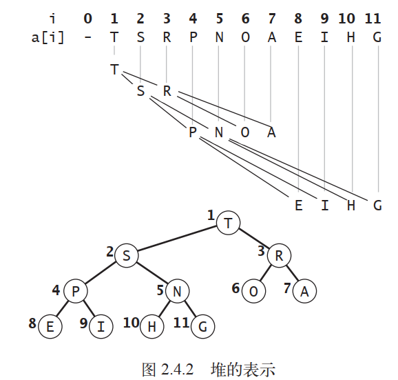
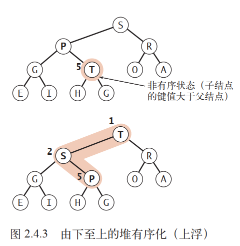
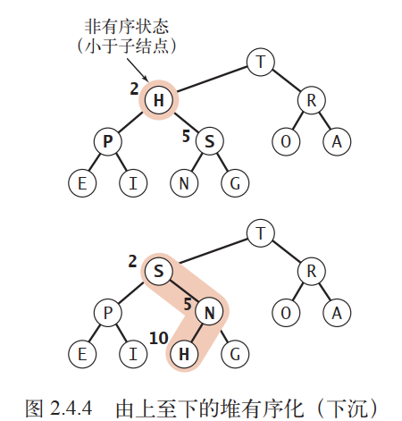
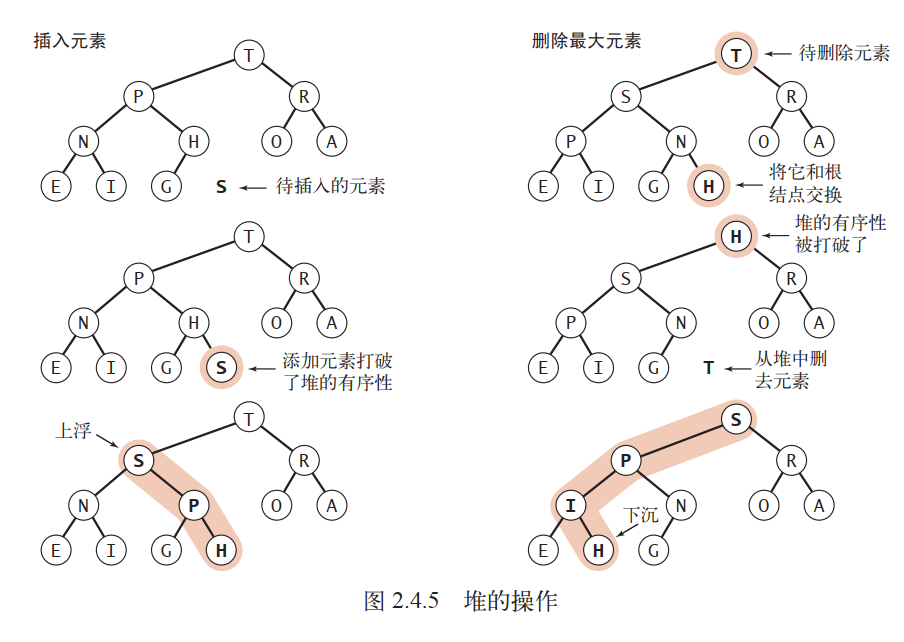
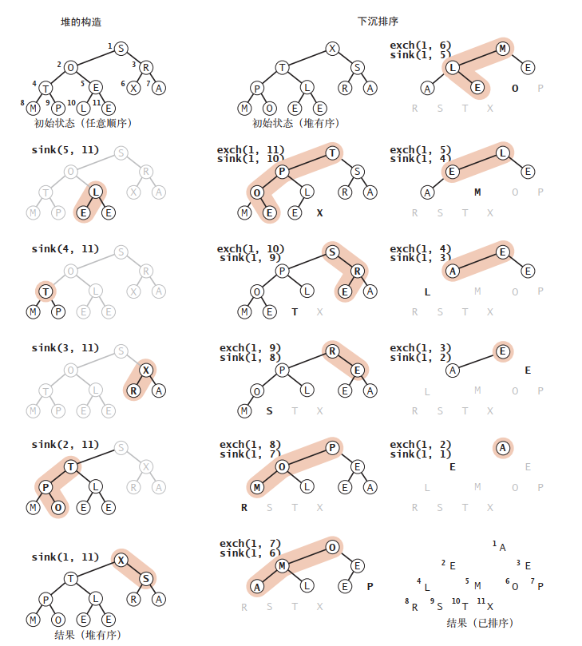
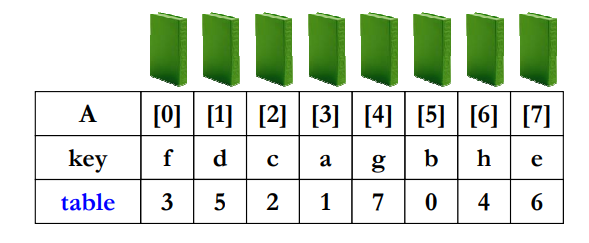
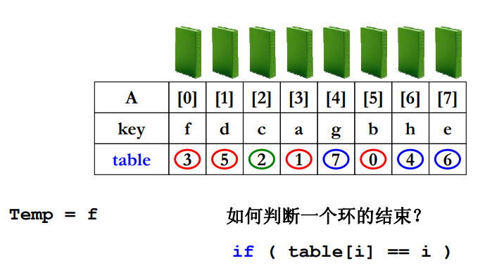

# 第一章 基本概念

+ 数据存储方式
  + 数组（顺序存储）
  + 链表（链式存储）
+ 数据结构：相互之间存在一种或多种特定关系的数据元素的集合 Data Structure = （D，S）
+ 数据结构学习：
  + 是什么
  + 如何实现，数组实现/链表实现
  + 操作
  + 应用

| 数据结构 | 数据类型 |
| -------- | -------- |
| method   | option   |
| field    | val      |

+ 补充

  + 强类型与弱类型
    + 强类型语言：强制类型定义的语言，一旦某个变量被定义类型，如果不经过强制转换，则其永远是该数据类型了，强类型语言包括：java、python、C++等。
    + 弱类型语言： 弱类型语言是一种弱类型定义的语言，某一个变量被定义类型，该变量可以根据环境变化自动进行转换，不需要经过显性强制转换。弱类型语言包括 vb 、PHP、java script 等。
    + 二者本质区别在于：是否会隐性的进行语言类别转变
  + 动态类型与静态类型
    + 动态类型：在运行期间才去做数据类型检查的语言
    + 静态类型：在编译其间检查的数据类型

  

  + 编译型与解释型语言
    + 编译型：**（一次性翻译 一本书）**使用专门的编译器，针对特定的平台，将高级语言源代码一次性的编译成可被该平台硬件执行的机器码，并包装成该平台所能识别的可执行性程序的格式。
    + 解释型：**（一行一行翻译 一本书,一行一行翻译）**使用专门的解释器对源程序逐行解释成特定平台的机器码并立即执行。是代码在执行时才被解释器一行行动态翻译和执行，而不是在执行之前就完成翻译。

## 1.2 算法与算法分析

### 1.2.1 算法

+ 算法

+ 算法效率度量
  + 时间复杂度：时间规模函数T(n)简化为一个数量级
  + 空间复杂度：算法所需存储空间的度量

# 第二章 线性表

+ 线性表的定义
+ 线性表的顺序表示与实现（顺序存储）
+ 线性表的链式表示与实现（链式存储）

## 2.1 线性表的类型定义

+ 定义：一个线性表是n个数据元素的有限序列

## 2.2 线性表的顺序表示

+ 线性表的顺序表示：利用一组地址连续的存储单元依次存储线性表的元素；
  + 设线性表每个元素需要占l个存储单元，并以所占的第一个存储单元的存储地址作为数据元素的存储地址。则第i+1个元素与第i元素地址位置存在如下关系
    LOC(a<sub>i+1</sub>) =  LOC(a<sub>i</sub>) + l
+ 线性表的元素可随机存取

+ 顺序表的增加与删除平均需要移动表中的一半元素，因此时间复杂度为O(n)

+ 顺序表的优缺点
  + **优点**：存储位置可用一个简单、直观的公式来表示
  + **缺点**：在做插入或者删除操作的时候，需要移动大量元素

## 2.3 线性表的链式表示和实现

**多画图**
  
+ 链式存储
  + 用一组任意的存储单元的存储线性表的数据元素（**存储单元可以连续也可以不连续**）
  + 链表中元素的逻辑顺序和物理顺序不一定相同；
  + 链表每个节点包含两部分信息：
    + 指针域(pointer)
    + 数据域(data)

### 单链表

+ 带头节点的单链表
  + 头节点数据域可以不存储信息，也可以存储线性表长度等附加信息
  + 作用：头结点的设置使得对链表的第一个位置上的操作与在表中其它位置上的操作一致，为了使空链表与非空链表处理一致
  
+ 建立单链表
  + 头插法：每插入的节点作为链表的第一个节点
  + 尾插法：每插入的节点作为链表的表尾
  
+ 单链表的查找
  + 按序号查找
  + 按值查找
  + 时间复杂度O(n)

+ 单链表的插入与删除
  + 单链表的插入与删除不需要移动元素
  + 插入与删除过程中，注意指针的变化情况
  + 操作过程中防止出链表
  
  

### 循环链表

+ 最后一个结点的指针域指向链表的头结点，整个链表的指针域链接成一个环
+ 循环链表的操作
  + 循环链表的操作
    + 判断是否是空链表：L->next==L ;
    + 判断是否是表尾结点：p->next==L ;
    + 算法中的循环条件不是p或p->next是否为空，而是它们是否等于头指针。
  
  
  

### 双向链表

+ 构成链表的节点中设置两个指针域
  + 一个指向其前驱的指针域prior
  + 一个指向其后继节点的指针域 next

+ 双向链表节点结构

``` C
 //双向链表节点结构
  typedef struct dlink_node
  {
      struct dlink_node *prev;
      struct dlink_node *next;
      void *val;  //能存储任意类型数据
  }node;
```

+ 双向链表删除节点
  
```C
  //删除节点pindex
  pindex->next->prev = pindex->prev;
  pindex->prev->next = pindex->next;
  free(pindex); //注意释放节点
```

+ 双向链表添加节点

```C
  //将pnode节点插入到pindex之前
  pnode->prev = pindex->prev;
  pnode->next = pindex;
  pindex->prev->next = pnode;
  pindex->prev = pnode;
```

# 第七章 排序

## 前提条件

```c
// 排序函数
void X_Sort(ElementType A[],int N)
```

+ 默认从小到大排序

+ N是正整数
+ 只讨论基于**比较**的排序
+ 只讨论内部排序
+ 稳定性：任意两个相等的数据，排序前后的相对位置不发生改变
+ 没有一种排序是任何情况下都具有最后表现
  
## 7.1 初级排序算法

### 7.1.1 选择排序

+ 思路
  + 找到数组中最小元素，将其与数组中第一个元素交换位置
  + 剩下元素中找到最小元素，将它与数组的第二个元素交换
  + ......

```java
 
void Selection_sort(int a[] int n){
  for(int i = 0;i < n;i++){
    int min = i;      //最小元素索引
    for(int j = i + 1;j < n;j++){
      if(less(a[j],a[min])){
        min = j;
      }
      swap(a[],i,min);
    }
  }
}

```

+ 时间复杂度

> 最好：O(n)
> 最坏：O(n²)

+ 优点
  + 因为只有nums[i] > nums[i + 1]时才交换，因此稳定
  + 简单，数组链表均可操作

### 7.1.2 插入排序

+ 思路：打牌的时候，整理牌

+ 时间复杂度

  + 同冒泡排序
  + 稳定

```java
void insertionSort(int[] a int n){
  for(int i = 0;i < n; i++){
    // 将a[i]插入a[i-1],a[i - 2]...
    for(int j = i;j > 0 && a[j] < a[j - 1];j--){
      swap(a,j,j - 1);
    }
  }
  for(int p = 1;p < N;p++){
    tmp = nums[p];/*摸下一张牌*/
    for(int i = p;i > 0 && nums[i - 1] > tmp;i--){

    }
  }
}

```

### 7.1.3 冒泡排序

```java
void bubbleSort(int[] nums, int N){

  for(int p = N - 1;p >= 0;p--){
   
    boolean flag = true;
    
    for(int i = 0;i < p;i++){ /*一遍冒泡*/
      
      if(nums[i] > nums[i + 1]){
        swap(nums[i],nums[i + 1]);
        flag = false;
      }
    }
    
    if(!flag){
      break;
    }
  }
}
```

### 7.1.4 希尔排序（by Donal Shell）

+ 思想：使数组中任意间隔为 h 的元素都是有序的

+ 定义增量序列
    $D_M > D_{M-1} > ... D_1 = 1$
+ 对每个$D_k$进行$D_k$间隔排序($k = M,M-1,...1$)
+ 注意："$D_k$-间隔"有序的序列，在执行"$D_{k-1}$-间隔"排序后，仍然是"$D_k$-间隔"有序的

+ 原始希尔排序  $D_M = N /2, D_k = D_{k+1}/2$

```java
void shellSort(int[] nums,int N){
  for(int d = N / 2; d > 0;d = d /2){/**希尔增量序列*/
    for(p = d;p < N;p++){   /**插入排序，相比于插入排序，将原来的i全部换为d*/
      int tmp = nums[p];
      for(i = p;i >= d && nums[i - d] > tmp;i = i - d){
        nums[i] = nums[i - d];
      }
      nums[i] = tmp;
    }
  }
}
```

+ 最坏情况时间复杂度为$\Theta(N^2)$，原因增量元素不互质，小的增量元素根本不起作用

+ Hibbard增量序列
  + $D_k = 2^k -1 $ 相邻元素互质
  + 最坏情况：$T = \Theta(N^{3/2})$
  + 猜想：$T_{}avg = O(N^{5/4})$
+ Sedgewick增量序列
  + {1，5，19，41，109，...} $9*4 - 9* 2^i 或 4^i - 3 * 2^i + 1$
  + 猜想：$T{avg} = \Theta(N^{7/6})，T_{worst} = O(N^{4/3})$
  
+ 增量序列为 $h = 3*h + 1,即 1, 4, 13, 40, 121, 364, 1093, ...$

```java
public void shellSort(int[] a, int n){
  int h = 1;
  while(h < n / 3){
    h = 3* h + 1; // h = 1, 4, 13, 40, 121, 364, 1093, ...
  } 
  while(h >= 1){
    /**插入排序*/
    for(int i = h;i < N;i++){
      for(int j = i;j >0 && a[j] < a[j - 1];j -= h){ // less(a[j],a[j - 1])
        swap(a,j,j - 1);
      }
      h = h / 3;
    }
  }
}

```

### 时间复杂度下界

+ 对于下标i < j,如果A[i] > A[j]，则称(i,j)是一对逆序对(inversion)

+ 问题：{34,8,64,51,32,21}有几对逆序对
+ 交换2个相邻元素正好消去1个逆序对
+ 插入排序T(N,I) = O(N + I),因此序列基本有序，则插入排序简单且高效
  
+ 定理：任意N个不同元素组成的序列平均具有N(N - 1)/4个逆序对
+ 定理：任何仅交换相邻两元素的来排序的算法，其平均时间复杂度为Ω(N²)，即最坏为O(N²)
+ 这意味着要提高算法效率，我们必须
  + 每次消去不止1个逆序对
  + 每次交换相隔较远的2个元素

## 7.2 归并排序

### 7.2.1 核心：有序子列的归并

```java
/**L = 左边起始位置，R = 右边起始位置，RightEnd = 右边终点位置*/
void Merge(ElementType A[],ElementType TmpA[],int L, int R, int RightEnd){
  LeftEnd = R - 1;  /**右边终点位置，假设左右两列相邻*/
  Tmp = L; /*存放结果的数组的初始位置*/
  NumElements = RightEnd - L + 1; /*元素个数*/
  while(L <= LeftEnd && R <= RightEnd){
    if(A[L] < A[R]) TmpA[Tmp++] = A[L++];
    else TmpA[Tmp++] = A[R++];
  }
  while(L <= LeftEnd){/*直接复制左边剩下的*/
    TmpA[Tmp++] = A[L++];
  }
  while(R <= RightEnd){/*直接复制右边剩下的*/
    TmpA[Tmp++] = A[R++];
  }

  for(i = 0;i < NumElements; i++,RightEnd--){
    A[RightEnd] = TmpA[RightEnd];
  }
}

```

### 实现1：递归算法——分而治之

+ java 实现

```java
private static Comparable[] aux;    //归并所需存储空间
void mergeSort(int[] a,int n){
  aux = new Comparable[n];  // 一次性分配存储空间
  sort(a, 0 ,n);
}

void sort(int[] a, int lo,int hi){
  if(hi <= lo) return;
  int mid = (lo + hi) / 2;
  sort(a,lo,mid); // 归并左半边
  sort(a,mid + 1, hi);//归并右半边
  merge(a,lo,mid,hi);//归并结果
}

void merge(int[] a, int lo,int mid,int hi){
  // 将a[lo,mid]和a[mid,hi]归并
  int i = lo,j = mid + 1;
  for(int k = lo;k < hi;k++){
    aux[k] = a[k];// 将a[lo,hi]复制到aux[lo,hi]
  }
  for(int k = lo;k < hi;k++){
    if(i > mid) a[k] = a[j++];  // 左半边耗尽
    else if(j > hi)  a[k] =  a[i++]; // 右半边耗尽
    else if(less[aux[i],aux[j]]) a[k] = a[i++];
    else a[k] = a[j++];
  }
}
```

+ 伪代码

```c++
void Merge_sort(ElementType A[],int N){
  ElementType *TmpA;
  TmpA = malloc(N * sizeof(ElementType));
  if(TmpA != NULL){
    Msort(A,TmpA,0,N-1);
    free(TmpA);
  }else Error("空间不足");
}

void MSort(ElementType A[],ElementType TmpA[],int L,int RightEnd){
  int center;
  if(L < RightEnd){
    center = (L + RightEnd) / 2;
    Msort(A,TmpA,L,center);
    Msort(A,TmpA,center + 1,RightEnd);
    Merge(A,TmpA,L,center + 1,RightEnd);
  }
}

/**L = 左边起始位置，R = 右边起始位置，RightEnd = 右边终点位置*/
void Merge(ElementType A[],ElementType TmpA[],int L, int R, int RightEnd){
  LeftEnd = R - 1;  /**右边终点位置，假设左右两列相邻*/
  Tmp = L; /*存放结果的数组的初始位置*/
  NumElements = RightEnd - L + 1; /*元素个数*/
  while(L <= LeftEnd && R <= RightEnd){
    if(A[L] < A[R]) TmpA[Tmp++] = A[L++];
    else TmpA[Tmp++] = A[R++];
  }
  while(L <= LeftEnd){/*直接复制左边剩下的*/
    TmpA[Tmp++] = A[L++];
  }
  while(R <= RightEnd){/*直接复制右边剩下的*/
    TmpA[Tmp++] = A[R++];
  }

  for(i = 0;i < NumElements; i++,RightEnd--){
    A[RightEnd] = TmpA[RightEnd];
  }
}
```

+ 时间复杂度：$O(NlogN)$

+ 稳定

### 实现2：非递归算法

+ 额外空间复杂度 $O(N)$

+ 伪代码

```C++
void Merge_sort(ElementType A[],int N){
  int length = 1;
  ElementType *TmpA;
  TmpA = malloc(N * sizeof(ElementType));
  if(TmpA != NULL){
    while(length < N){
      Merge_pass(A,TmpA,N,length);
      length = length * 2;
      Merge_pass(A,TmpA,N,length);
      length = length * 2;
    }
    free(TmpA);
  }else Error("空间不足");
}

void Merge_pass(ElementType A[],ElementType TmpA[], int N, int length){     /*length = 当前有序子列的长度*/
  for(i = 0;i <= N - 2 * length;i = i + 2 * length){
    Merge1(A,TmpA,i,i + length;i + 2 * length - 1);
  }
  if(i + lenght < N){/* 归并最后2个子列*/
    Merge1(A,TmpA,i,i + length,N - 1); /*与Merge的区别在于Merge最终有序的子列放在A中，而Merge1有序子列不放入A中，在TmpA中*/
  }else{/*最后只剩一个子列*/
    for(j = i;j < N;j++){
      TmpA[j] = A[j];
    }
  }
}
```

## 7.3 快速排序

### 7.3.1 算法概述

+ 策略：分而治之

+ 注意细节：
  + 主元如何选择，最好情况每次正好中分 T(N) = O(NlogN)
  + 如何分子集

```C
void QuickSort(ElementType A[],int N){
  if(N < 2) return;
  pivot = 从A[]中选取一个主元；
  将S = {A[] \ pivot}分成2个子集
    A1 = {a ∈ S | a <= pivot}
    A2 = {a ∈ S | a >= pivot}
  A[] = QuickSort(A1,N1)∪pivot∪QuickSort(A2,N2)；
}
```

### 7.3.2 选主元

+ 取头、中、尾的中位数
  + 如 8 12 3则选择8
  
```c++
ElementType Median3(ElementType A[] int Left,int Right){
  int center = (Left + Right)  / 2;
  if(A[Left]  > A[center]){
    Swap(&A[Left],&A[center]);
  }
  if(A[Left]  > A[Right]){
    Swap(&A[Left],&A[Right]);
  }
  if(A[center]  > A[Right]){
    Swap(&A[center],&A[Right]);
  }
  /*A[Left] <= A[center] <= A[Right]*/
  Swap(&A[center],&A[Right - 1]) /*将pivot藏到右边*/
  /*只需要考虑A[Left + 1]...A[Right - 2]*/
  return A[Right - 1];    /*返回pivot*/
}

```

### 7.3.3子集划分

+ 如果有元素刚好等于pivot怎么办？
  + 停下来交换 √
  + 不理他继续移动 ×

### 小规模数据处理

+ 快速排序的问题
  + 需要递归
  + 对小规模的数据(例如N < 100)可能还不如插入排序

+ 解决方案
  + 当递归的数据规模充分小时，则停止递归，直接调用简单排序(比如插入排序)
  + 在程序中定义一个阈值cutoff

### 算法实现

```c++
void Quick_Sort(ElementType A[] int N){
  QuickSort(A,0,N - 1);
}

void QuickSort(ElementType A[] int Left, int Right){
  if(Right - Left >= Cutoff){
    pivot = Median3{A,Left,Right};
    i = Left;
    j = Right - 1;
    for(;;){
      while(A[i++] < pivot){}
      while(A[--j] > pivot){}
      if(i < j){
        Swap(&A[i],&A[j]);
      }else{
        break;
      }
    }
    Swap(&A[i],&A[Right - 1]);
    QuickSort(A,Left,i - 1);
    QuickSort(A,i + 1,right);
  }else{
    Insertion_sort(A + Left,Right -　Left + 1);
  }
}
```

## 7.4 优先队列(堆排序)

+ 一个合适的数据结构应该支持两种操作： 删除最大元素和插入元素。这种数据类型叫做优先队列

### 7.4.1 API

+ 泛型优先队列的API

```java
public class MaxPQ<Key extends Comparable<Key>>{
  MaxPQ()             //创建一个优先队列
  MaxPQ(int max)      //创建一个初始容量为max的优先队列
  MaxPQ(Key[] a)      //用a[]中元素创建一个优先队列
  void insert(Key v)  //向优先队列中插入一个元素
  Key max()           // 返回优先队列中的最大值
  Key delMax()        // 删除并返回最大元素
  boolean isEmpty()   // 返回优先队列是否为空
  int size()          // 返回优先队列中元素个数
}
```

### 7.4.2 初级实现

+ 1. 数组实现(无序)

+ 2. 数组实现(有序)
+ 3. 链表表示法


### 7.4.3 堆的定义

+ 二叉堆：一组能够用**堆有序的完全二叉树**排序的元素，并在数组中按照层级储存（不使用数组的第一个位置）。

+ 当一棵二叉树的每个结点都大于等于它的两个子结点时，它被称为**堆有序**。
+ 在一个堆中，位置 k 的结点的父结点的位置为
k/2，而它的两个子结点的位置则分别为 2k 和 2k+1。

+ 用数组（堆）实现的完全二叉树的结构是很严格的，但它的灵活性已经足以让我们高效地实现优先队列。用它们我们将能实现**对数级别**的插入元素和删除最大元素的操作。

### 7.4.4 堆的算法

+ 我们用长度为N+1的数组pq[]来表示一个大小为N的堆，不使用 pq[0]

+ 堆的操作会首先进行一些简单的改动，打破堆的状态，然后再遍历堆并按照要求将堆的状态恢复。我们称这个过程叫做堆的有序化(reheapifying)
+ 堆实现的比较和交换方法

```java
private boolean less(int i, int j){
   return pq[i].compareTo(pq[j]) < 0; 
}
private void exch(int i, int j){
  Key t = pq[i]; pq[i] = pq[j]; pq[j] = t; 
}
```

#### 由下至上的堆有序化(上浮)

+ 如果堆的有序状态因为某个结点变得比它的父结
点更大而被打破， 那么我们就需要通过交换它和它的
父结点来修复堆。

```java
private void swim(int k){
  while(k > 1 && less(pq[k / 2],pq[k])){
    exch(k/2,k);
    k = k / 2;
  }
}
```



#### 由上至下的堆有序化(下沉)

+ 如果堆的有序状态因为某个结点变得比它的两个子结点或是其中之一更小了而被打破了， 那么我们可以通过将它和它的两个子结点中的较大者交换来恢复堆。

```java
private void sink(int k){
  while(2 * k < N){
    int j = 2 * k;
    if(j < N && less[j,j + 1]){
      j++;
    }
    if(!less(k,j)) break;
    exch(k,j);
    k = j;
  }
}
```





+ 基于堆的优先序列

```java
public class MaxPQ<Key extends Comparable<Key>>{
  private Key[] pq; // 基于堆的完全二叉树
  private int N = 0; // 存储于pq[1..N]中， pq[0]没有使用
  public MaxPQ(int maxN){ 
    pq = (Key[]) new Comparable[maxN+1]; 
  }
  public boolean isEmpty(){ 
    return N == 0; 
  }
  public int size(){
    return N; 
  }
  public void insert(Key v){
    pq[++N] = v;  
    swim(N);
  }
  public Key delMax(){
    Key max = pq[1]; // 从根结点得到最大元素
    exch(1, N--); // 将其和最后一个结点交换
    pq[N+1] = null; // 防止对象游离
    sink(1); // 恢复堆的有序性
    return max;
  }
  // 辅助方法的实现请见本节前面的代码框
  private boolean less(int i, int j)
  private void exch(int i, int j)
  private void swim(int k)
  private void sink(int k)
}
```

#### 多叉堆

+ 基于用数组表示的完全三叉树构造堆并修改相应的代码并不困难。对于数组中 1 至 N 的 N 个元素，位置 k
的结点大于等于位于 3k-1、 3k 和 3k+1 的结点，小于等
于位于 (k+1)/3 的结点。

### 7.4.4 堆排序

#### 7.4.4.1 选择排序

```java
void Selection_Sort(ElementType A[], int N){
  for(int i = 0;i < N;i++){
    /* 从A[i]~A[N-1]找到最小元，并将其位置赋值给MinPosition*/
    MinPosition = ScanForMin(A,i,N-1)
    /*将未排序部分的最小元换到有序位置的最后部分*/
    swap(A[i],A[MinPostion]);
  }
}
```

+ 时间复杂度，无论如何$T{avg} = \Theta(N^2)$

+ 问题在于：如何快速找到最小元————最小堆！！

#### 堆排序

+ 对选择排序的改进

+ 堆排序可以分为两个阶段
  + 在堆的构造阶段，我们将原始数组重新组织安排进一个堆
  + 下沉排序阶段，从堆中递减取出所有元素并得到排序结果

```java
public void sort(Comparable[] a){
  int N = a.length;
  // 构造堆
  for(int k = N/2;k >= 1;k --){
    sink(a,k,N);
  }
  while(N > 1){
    exch(a,1,N--);
    sink(a,1,N);
  }
}
```



##### 算法1

+ 时间复杂度$T(N) = O(N log N)$

```java
void Heap_Sort(ElementType A[], int N){
  buildHeap(A); /*将A构建为最小堆，时间复杂度为O（N）*/
  for(i = 0;i < N;i++){
    tempA[i] = DeleteMin(A);/*O（logN）*/
  }
  for(i = 0;i < N;i++){/*O（N）*/
    A[i] = tempA[i];
  }
}
```

##### 算法2

+ 思路：将上一题中最小堆调整为最大堆

+ 定理：堆排序处理N个不同的元素的随机排列的平均比较次数是$2NlogN - O(NLogLogN)$
+ 虽然堆排序给出的最佳平均时间复杂度，但实际效果不如用SedgeWick增量序列的希尔排序

```java
void Heap_Sort(ElementType A[], int N){
  for(i = N / 2;i >= 0;i++){// 调整为最大堆
    precDown(A,i,N)   
  }
  for(i = N - 1;i > 0;i--){
    swap(&A[0],&A[i]); /*delete max*/
    precDown(A,0,i)
  }
}
```

***

## 7.5 表排序

### 算法概述

+ 间接排序
  + 定义一个指针数组作为表(table)
  
  + 如果仅要求按顺序输出，则输出：
  $A[table[0]],A[table[1]],......,A[table[N - 1]]$

### 物理排序

+ N个数字的排列由若干个独立的环组成
  

### 复杂度分析

+ 最好情况：初始即有序

+ 最坏情况：
  + 有$ N / 2$个环，每个环包含2个元素
  + 需要$3N / 2$次元素移动
  + $T = O(mN)$，m是每个A元素的复制时间。

***

## 7.6 基数排序

### 桶排序

+ 举个例子
  > 假设有N个学生，其成绩是0~100之间的整数(于是有101个不同的成绩值。)如何在线性时间内将学生成绩排序？

```C
void Bucket_Sort(ElementType A[], int N){
  count[]初始化;
  while(读入1个学生的成绩grade)
    将该生插入count[grade]链表;
  for(int i = 0;i < M; i++){
    if(count[i])
      输出整个count[i]链表
  }
}
```

+ 时间复杂度：$T(N,M) = O(M + N)$

+ 如果过M远大于N该怎么办？

### 基数排序

> 假设我们有N = 10个整数，每个整数的值在0到999之间(于是有M = 1000个不同的值)。还有可能在线性时间内排序吗？
> 输入序列：64,8,216,512,27,729,0,1,343,125
> 次位优先(Least Significant Digit)
> T = O(P(N + B))


### 多关键字排序

> 一副扑克牌是按2种关键字排序的

> 可以将花色视为主位，面值视为次位进行排序

+ 主位优先排序(Most Significant Digit):为花色建4个桶，将花色分别放入对应的桶内，在每个桶内分别排序最后合并结果


+ 次位优先排序(Least Siginificant Digit)排序：为面值建13个桶，将结果合并，然后再为花色建4个桶


***

## 7.7 排序算法比较


