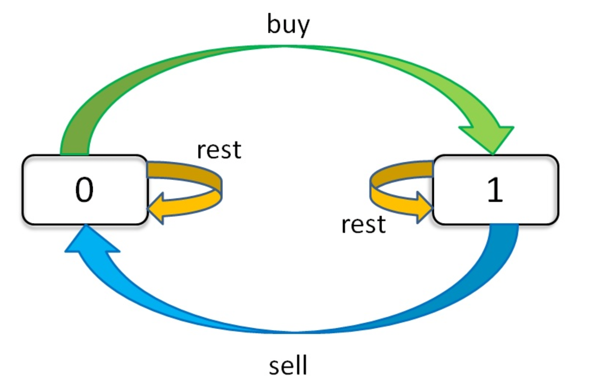

# 动态规划专项

## Day06

+ 分清**状态**与**转移**
+ 有限状态机

### 1. 乘积为正数的最长子数组长度

```
给你一个整数数组 nums ，请你求出乘积为正数的最长子数组的长度。

一个数组的子数组是由原数组中零个或者更多个连续数字组成的数组。

请你返回乘积为正数的最长子数组长度。

输入：nums = [1,-2,-3,4]
输出：4
解释：数组本身乘积就是正数，值为 24 。

```

+ 【思路一】：四指针遍历
  + 利用子数组包含奇数个负数时，此时子数组乘积一定为负；
  + 包含偶数个负数时，乘积则为正；
  + 包含0，乘积为0；
  + 定义
    + start用于记录0之后的第一个非0数的位置，end结尾
    + left记录第一个负数的位置，right记录最后一个负数的位置
    + curmax用于记录当前子数组中最长乘积为正子数组的长度

  ```
    if(nums[i] == 0 ｜｜ i到达数组末尾) ：start = i + 1， end = i-1
    if(cnt % 2 == 0) curmax = end - start
    else curmax = max(right - start, end - left)
    if(nums[i] < 0): cnt++, left = i if cnt = 1,right++
    if(nums[i] > 0): 不做任何状态变更 
  ```

  + 【注意】：循环时，i的边界条件的确定
+ 【思路二】：动态规划法
  + 定义两个状态：
    + 当前位置下乘积为正数的最长子数组长度pcur
    + 当前位置下乘积为负数的最长子数组长度ncur
  + 定义状态转移方程
  
  ```
          0  -1  1   -1  1   0   1  1   -1    -1 
  pcur    0   0  1   3   4   0   1  2    0    4
  ncur    0   1  2   2   3   0   0  0    3    4
  if(nums[i] > 0)
      pcur  = pcur + 1
      ncur  = ncur == 0 ? 0 ：ncur + 1
  if(nums[i] < 0)
      pcur = ncur > 0 ？ncur + 1 ：0
      ncur = pcur + 1
  ```

## Day 07

### 1.最佳观光组合


### 2.买卖股票专题
  + 用自然语言去解释状态更加容易理解

  + 理清状态与选择
    + 状态：天数；允许交易的最大次数；当前持有状态
    + 选择：买入，卖出、无操作(buy,sell,rest)。注意buy必须在sell之后，sell也必须在buy之后，rest则有两种，一种是buy之后rest，一种是sell之后rest，而且buy只能在k>0之后进行
    ```
    for  0 <= i < n：
      for 0 <=k < K:
        for s i [0,1]:
          dp[i][k][s] = max(buy,sell,rest)
  
  + 状态转移框架
    
  
## Day 13

### 1. 下降路径最小和
给你一个 n x n 的方形整数数组 matrix ，请你找出并返回通过 matrix 的下降路径的最小和。
下降路径可以从第一行中的任何元素开始，并从每一行中选择一个元素。在下一行选择的元素和当前行所选元素最多相隔一列（即位于正下方或者沿对角线向左或者向右的第一个元素）。具体来说，位置 (row, col) 的下一个元素应当是 (row + 1, col - 1)、(row + 1, col) 或者 (row + 1, col + 1)。

+ 状态：表示从位置为(r,c)的元素开始的下降路径最小和。因为位置(r,c)可以下降到(r+1,c-1),(r+1,c),(r+1,c+1)，因此状态转移方程为：
```
dp[r][c] = A[r][c] + min(dp[r+1][c-1],dp[r+c][c],d[r+1][c+1])
```
+ 因此从 N-2 行开始计算dp[r][c]，从下往上计算，计算至A[0]，min(A[0])即为所求结果。
+ 注意处理第一列，第N-1列的元素,参考如下代码：
```java
for (int r = N-2; r >= 0; --r) {
  for (int c = 0; c < N; ++c) {
      // best = min(A[r+1][c-1], A[r+1][c], A[r+1][c+1])
      int best = A[r+1][c];
      if (c > 0)
          best = Math.min(best, A[r+1][c-1]);
      if (c+1 < N)
          best = Math.min(best, A[r+1][c+1]);
      A[r][c] += best;
  }
```