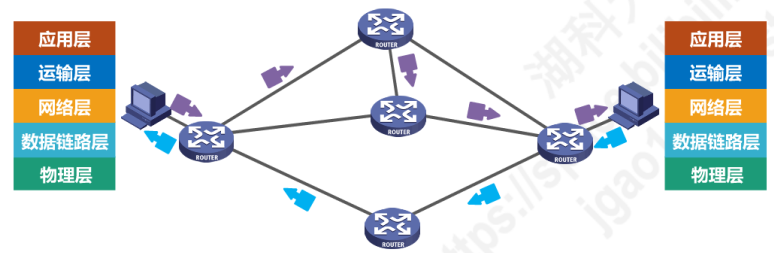
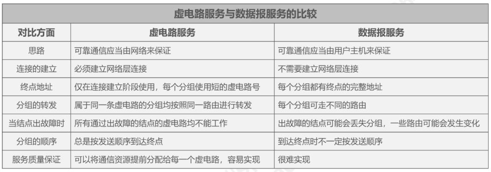
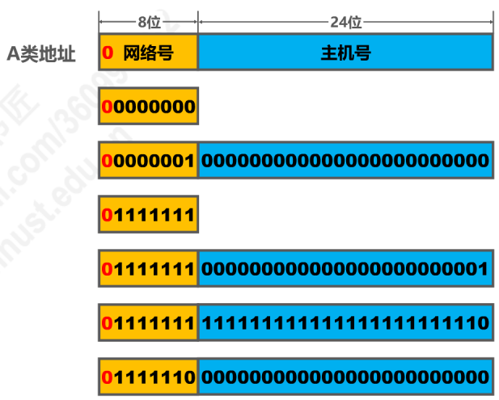
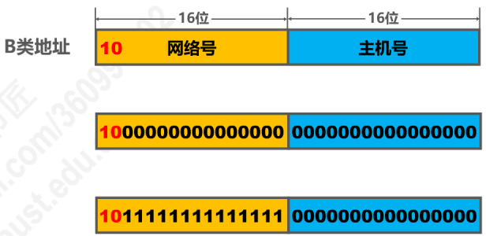
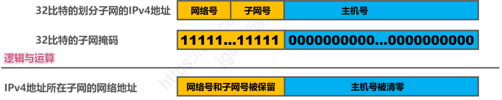
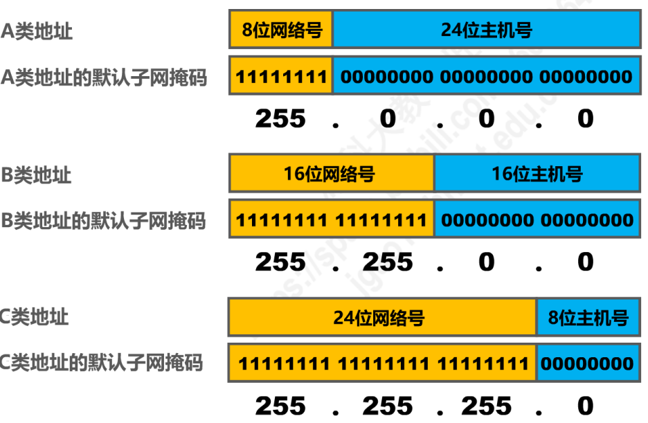
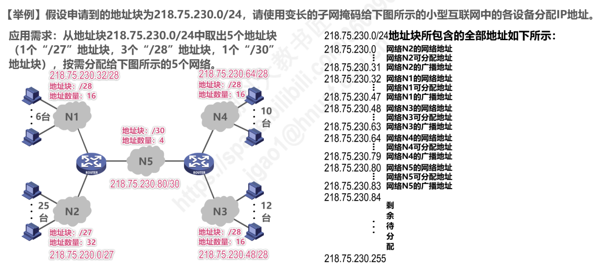
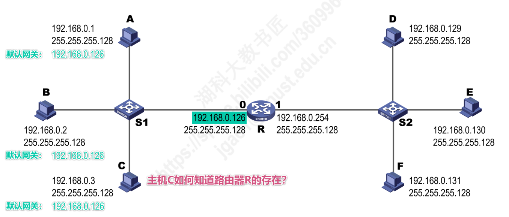
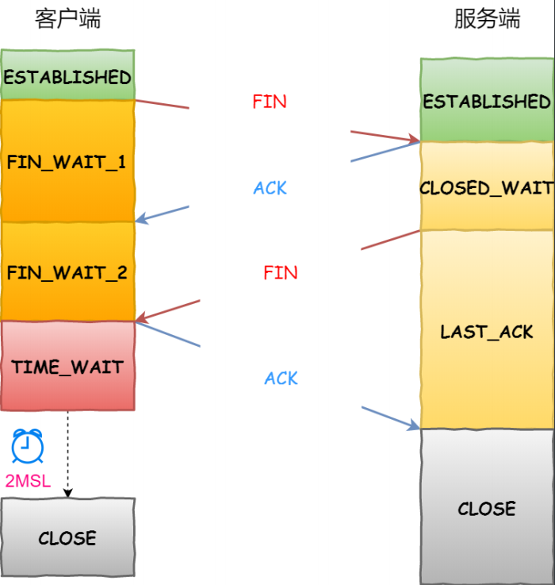

> # 1. 概述

## 1.1

## 1.2 因特网概述

* 网络、互联网和因特网
  
* 因特网发展的三个阶段
  * Apnet
  * 三级结构
  * 
  * 因特网服务提供者ISP
    * 基于ISP的三层结构的因特网
    * 国际性区域，主干网
    * 区域性或国家型
* 因特网的标准化
* 因特网的组成
  * 边缘部分
  * 核心部分

## 1.3 三种交换方式

### 电路交换

* 电话交换机接通电话线的方式称为电路交换
* 从通信资源的分配的角度来看，交换机（Switching）就是按照某种方式动态地分配传输线路的资源
* 电话交换的三个步骤
  
### **分组交换（packet Switching）**

* 发送方
* 路由器
* 接收方
  
### 报文交换

### 电路交换、报文交换、分组交换的对比

## 1.4 计算机网络的定义和分类

### 计算机网络的定义

* **简单定义：** 一些互联的、自治的计算机的集合
  * 互联
  * 自治
  * 集合
* 较为好的定义：
  
### 计算机网络分类

* 交换技术分类
* 按使用者分类
  * 公用网
  * 专用网
* 传输介质

* 覆盖范围
  * WAN
  * MAN
  * PAN
  * LAN
* 按拓扑结构分类
  * 总线型网络
  * 星型网络
  * 环型网络
  * 网状型网路欧

## 1.4 计算机网络性能指标

        定义    单位
速率
带宽
吞吐量
时延
时延带宽积
往返时间
利用率
丢包率

## 1.5 计算机网络

### 常见的计算机网络体系结构

### 计算机网络体系结构分层的必要性

+ 物理层：解决使用何种信号来传输比特的问题

+ 数据链路层：解决分组在一个网络（或一段链路）上传输的问题
  + 如何标识网络中的各个主机（主机编址问题，例如MAC地址)
  + 如何从信号所表示的一连串比特流中区分出地址和数据
  + 如何协调各主机争用总线

+ 网络层：解决分组在多个网络上传输(路由)的问题
  + 如何标识各网络以及网络中的各主机（网络和主机
  + 路由器如何转发分组，如何进行路由选择

+ 传输层：解决进程之间基于网络通信的问题
  + 如何解决进程之间网络的通信问题
  + 传输错误时，如何处理

+ 应用层：解决应用进程的交互来实现特定网络应用的问题
  + 通过应用进程之间的交互来完成特定的网络应用 

### 计算机网络体系结构分层思想举例

### 计算机网络体系结构中的专用术语
实体：任何可发送或接受信息的硬件或软件进程

协议：控制两个对等实体进行逻辑通信的规则的集合
  + 三要素：
    + 语法：定义所交换信息的格式
    + 语义：定义双方索要完成的操作
    + 同步：定义双发收发的时序关系
服务：在协议的控制下，两个对等实体间的逻辑通信使得本层能够向上一层提供服务
  + 要实现本层协议还需要使用下面一层所提供的服务
  + 服务访问点：同一系统中
  + 协议数据单元
  + 服务数据单元SDU

***

> # 2. 物理层
## 2.1 物理层的基本概念

## 2.2 物理层下面的传输媒体（了解）
* 传输媒体不属于网络结构中任何一类

### 导引型传输媒体

### 非导引型传输媒体 

## 2.3 传输方式
* 串行传输与并行传输

* 同步传输与异步传输

* 单工、半双工和全双工

## 2.4 编码与调制（重点 ）

## 2.5 信道的极限容量
* 奈氏准则
* 香农公式

***

> # 3. 数据链路层

## 3.1 数据链路层概述

* 三个问题（使用点对点信道）
  * 封装成帧
  * 差错检测
  * 可靠传输：尽管误码是不能完全避免，但若实现发送方发送什么，接收方就能接收到什么，就称为可靠传输

## 3.2 封装成帧

## 3.3 差错检测

## 3.4 可靠传输

### 3.4.1 可靠传输的基本概念

### 3.4.2 可靠传输的实现机制——停止-等待协议

### 3.4.3 可靠传输的实现机制——回退N帧协议

### 3.4.4 可靠传输的实现机制——选择重传协议

## 3.5 点对点协议PPP

***

> # 4. 网络层

## 4.1 网络层概述
* **网络层的主要任务**：实现网络互联，进而实现数据包在各网络之间的传输
* 要实现网络层任务，需要解决**如下问题**：
  * 网络层向运输层提供怎样的服务("可靠传输"还是"不可靠传输")
  * 网路层**寻址问题**
  * **路由选择**问题
* 因特网(Internet)是目前全世界用户数量最多的互联网，它使用TCP/IP协议
* 由于TCP/IP协议栈的网络层使用网际协议IP，是整个协议栈的核心协议，因此在TCP/IP协议栈中网络层常称为网际层。

## 4.2 网络层提供的两种服务
* **面向连接的虚电路服务**
  * 可靠通信由网络来保证
  * 必须建立网络层的连接——虚电路VC(Virtual Circuit)
  * 通信双反方沿着已建立的虚拟电路发送分组
  * 目的主机地址尽在连接建立阶段使用，之后每个分组的首部只需要携带一条虚电路的编号(构成虚电路的每一段链路都有一个虚电路编号)
  * 该种通信方式如果再使用可靠传输的网络协议，就可使所发送的分组最终正确到达接收方(无差错按序到达、不丢失、不重复)
  * 通信结束后，需释放之间所建立的虚电路。
  * 许多广域分组交换网都使用面向连接的虚电路服务。如X.25和逐渐过时的帧中继FR、异步传输模式ATM等
  
  
* **无连接的数据报服务** 
  * 可靠通信应当由用户主机来保证
  * 不需要建立网络层连接
  * 每个分组可走不同的路径
  * 每个分组首部必需携带目的主机的完整地址
  * 所传送的分组可能出现误码、丢失、重复和失序
  * 由于由于网络本身不提供端到端的可靠传输服务，因此使得网络中路由器可以做得比较简单，而且价格低廉
  * 因特网采用了该种设计思想，也就是将复杂的网络处理功能置于因特网边缘(用户主机和其内部的运输层),而将分组交付功能置于因特网核心。
  
  

* **面向连接的虚电路服务和无连接的数据报服务对比**
  
## 4.3 IP协议

### 4.3.1 IPv4地址概述
* **IPv4地址**就是给因特网上的**每一台主机（或路由器)的每一个接口**分配一个在全世界范围内是**唯一的32比特的标识符**
* IPv4地址编址方法经历了3个历史阶段

* 点分十进制表示
 

### 4.3.2 分类编址的IPv4地址

* **注意事项：**
  * 只有A、B和C类地址才能分配给网络中的主机或路由器的各个接口
  * 主机号**全为0**的地址是**网络地址**，不能分配给主机或路由器的各个接口
  * 主机号为**全1**的地址是**广播地址**，不能分配给主机或路由器的各个接口
 

* **A类地址** 
  
  * 最小网络号为0，保留不指派
  * 最大网络号为127，保留不指派
  * 第一个可指派网络号为1，网络地址为1.0.0.0
  * 最后一个可指派网络号为126，网络地址为126.0.0.0
  * 可指派网络数量为$2^{8-1} - 2 = 126$
  * 每个网络中可分配的IP地址为$2^{24} - 2 = 16777214$
 

* **B类地址**
  
  * 最小网络号也是第一个可指派的网络号**128.0**，网络地址：128.0.0.0
  * 最大网络号也是最后一个可指派的网络号**191.255**，网络地址:191.255.0.0
  * 可指派网络数量为$2^{16 - 2} = 16384$
  * 每个网络总能可分配的IP地址数量为$2^{16} - 2 = 65534$
   

* **C类地址**
  
  * 最小网络号，也是第一个可指派网络号**192.0.0**，网络地址为192.0.0.0
  * 最大网络号，也是最后一个可指派网络号**223.255.255**，网络地址为223.255.255.0
  * **可指派网络数量**为$2^{24 - 3} = 2097152$
  * 每个网络中可分配IP地址数量：$2^{8} - 2 = 254$
 

* **总结**

### 4.3.3 划分子网的IPv4地址

* 为新增网络申请新的网络号会带来如下弊端
  * 需要等待时间花费更多费用
  * 增加其他路由器中路由表记录的数量
  * 浪费原有网络号中剩余大量IP地址
 

* **利用子网掩码从主机号部分借用几个比特作为子网号**
 

* **32比特的子网掩码可以表明分类IP地址的主机号被借用了几个比特作为子网号**
  * 子网掩码**使用连续的比特1来对应网络号和子网号**
  * 子网掩码**使用连续的比特0来对应主机号**
  * 将划分子网的**IPv4地址**与其相对应的**子网掩码**进行**与逻辑运算**就可得到IPv4地址**所在子网的网络地址**

 

* **默认子网掩码**
  * 是在在未划分子网的情况下所使用的子网掩码
  
 

* 给定一个分类的IP地址和相应的子网掩码，可确定子网划分细节：
  * 划分**子网数量**
  * 每个子网可分配的**IP地址数量**
  * 每个子网的**网络地址**和**广播地址**
  * 每个子网可分配的**最小和最大地址**
  

### 4.3.4 无分类编址的IPv4地址
* 划分子网在一定程度上缓解了因特网在发展中遇到的困难，但数量巨大的C类网因为其地址空间太小并**没有得到充分利用**
 

* 解决方案：采用**无分类编制**的方法来解决IP地址紧张的问题，同时成立IPv6工作组研究新版本IP彻底解决IP地址耗尽问题
 

* 1993年IETF发布了无分类域间路由选择CIDR(Classless Inter-Domain Routing)
  * CIDR消除了传统的A类、B类和C类地址，以及划分子网的概念
  * CIDR可更加有效的分配IPv4的地址空间
 

* CIDR使用"斜线记法"或称CIDR记法。即在IPv4地址后面加上斜线"/",斜线后为网络前缀所占比特数量
  
 

* CIDR实际上是将网络前缀都相同的连续的IP地址组成一个"CIDR地址块"
 

* **我们只要知道CIDR的一个地址块，就可以知道该地址块的全部细节：**
  * 地址块的最小地址和最大地址
  * 地址块中的地址数量
  * 地址块聚合某类网络(A类、B类和C类)的数量
  * 地址掩码(也可继续称为子网掩码)
  
   

* **路由聚合(构造超网)：找共同前缀**
  * 网络前缀最长，地址块越小，路由越具体
  * 若路由表查转发分组时发现有多条路由可选，则选择网络前缀最长的那条，称之为最长前缀匹配，因为这样路由更具体
  

### 4.3.5 IPv4地址的应用规划
* **定长的子网掩码FLSM(Fixed Length Subnet Mask)**
  * 使用同一个子网掩码来划分子网
  * 每个子网所分配的IP地址数量相同，造成IP地址浪费
  
   
* **变长的子网掩码VLSM(Variable Length Subnet Mask)** 
  * 使用不同的子网掩码来划分子网
  * 每个子网所分配的IP地址数量可以不同，尽可能减少IP地址的浪费
  
  **注意分配地址块的分配原则是**：每个字块的起点位置不能随意选取，只能选取块大小整数倍的地址作为起点。

## 4.4 IP 数据报的发送和转发过程
* **IP数据报的发送和转发包括：**
  * 主机发送IP数据报
  * 路由器转发IP数据报
 

* **主机发送IP数据报**
  * 源主机判断目的主机是否与自己在同一网络
    * 若在同一个网络，则称之为直接交付
    * 若不在同一个网络，则属于间接交付，传输给主机所在网络的默认网关，由默认网关帮忙转发
  * 如何判断是否在同一网络：目的主机的IP地址与源主机的子网掩码进行与逻辑运算，得到的网络地址如果与源主机的网络地址不相同则不在同一网络
  * 主机如何知道路由器R的存在：将路由器的IP地址设置为默认网关
  
 

* **路由器转发IP数据包**
  * 检查IP数据报首部是否出错
    * 若出错，则直接丢弃该IP数据报并通告源主机
    * 若没出错，则进行转发
  * 根据IP数据报的目的地址在路由表中查找匹配的条目
    * 若找到匹配的条目，则转发给条目中的吓一跳;
    * 若找不到，则丢弃该IP数据报并通告源主机
  * 路由器是隔离广播域的

> * 中继器和集线器工作在物理层，既不隔离冲突域也不隔离广播域
> * 网桥和交换机(多端网桥)工作在数据链路层，可以隔离冲突域，不能隔离广播域
> * 路由器工作在网络层，既隔离冲突域，也隔离广播域

## 4.5 静态路由配置及其可能产生的路由环路问题
* 静态路由配置
  * 指用户或网络管理员使用路由器的相关命令给路由器人工配置路由表
    * 配置方式简单，但不能及时适应网络状态的变化
    * 只在小规模的网络中使用
 

* 使用静态路由配置可能出现以下导致产生路由环路的错误
  * 配置错误
  * 聚合了不存在的网络
  * 网络故障
 

* 路由条目的类型
  * 直连网络
  * 静态路由(人工配置)
  * 动态路由(路由选择协议)
 

* 特殊的静态路由条目
  * 默认路由(目的网络为0.0.0.0,地址掩码为0.0.0.0)
  * 特定主机路由(目的网络为特定主机的IP，地址掩码为255.255.255.255)
  * 黑洞路由(吓一跳为null0)
## 4.6 路由选择协议

### 4.6.1 路由选择协议概念
* 静态路由选择
  
* 动态路由选择
  
* 因特网所选择的路由选择协议的主要特点
  * 自适应：
  * 分布式
  * 分层次
* 路由选择协议
* 路由器的基本结构

### 4.6.2 路由信息协议RIP的基本工作原理

### 4.6.3 开放最短路径优先OSPF的基本工作原理

### 4.6.4 边界网关协议BGP的基本工作原理

## 4.7 IPv4数据报的首部格式

## 4.8 网际控制报文协议ICMP
* ICMP 差错报文
  * 终点不可达
  * 源点抑制
  * 时间超过
  * 参数问题
  * 改变路由(重定向)

## 4.9 虚拟专用网VPN与网络地址转换NAT

***

> # 5.传输层

## 5.1 概述

* 计算机网络中物理层、数据链路层以及网路层共同解决了将主机通过异构网络互联起来所面临的问题，实现了主机到主机间的通信
* 实际计算机网络中通信的主体是 位于通信两端主机中的进程。
* 运输层的任务： 为运行在不同主机上的应用进程提供直接的通信服务,因此又称为端到端协议
* 插入PPT图片

## 5.2 运输层端口号、复用与分用的概念

### 5.2.1 运输层端口号

* 运行在计算机上的进程使用进程标识符PID来标识
* 不同的操作系统又使用不同格式的进程标识符
* 为了使不同操作系统间的计算机间的应用进程之间的网络进程能够进行通信，必须使用统一的方法对TCP/IP体系的应用进程进行标识
* TCP/IP体系使用端口号码来区分不同的应用进程
  * 端口号使用16bit表示，取值范围为0～65536
    * 熟知端口号
    * 登记端口号
    * 短暂端口号
  * 端口号只具有本地意义，即端口号只是为了标识本计算机应用中的各进程，在因特网中，不同计算机的相同端口号是没有联系的。

### 5.2.2 发送方的复用和接收方的分用
为什么

### 5.2.3 TCP/IP体系的应用层常用协议所使用的运输层熟知端口号

## 5.3 UDP和TCP的对比
UDP 无连接  TCP 有连接
UDP 支持单播、多播与广播 TCP仅支持单播
UDP 是面向应用报文的，包发送 TCP 面向字节流的，正是TCP实现可靠传输，拥塞控制、流量控制的基础，全双工通信
UDP 无连接不可靠传输服务（适用于实时应用）  TCP 有连接可靠的传输服务，适用于可靠传输应用
UDP 短文首部，8个字节 源端口 目的端口 长度 校验和
TCP 报文首部最小20个字节，最大60个字节

## 5.4 TCP的流量控制

* 流量控制
* 滑动窗口机制

## 5.5 TCP的拥塞控制

* 拥塞

* 四种拥塞控制算法的基本原理，假定如下条件：
  * 1. 数据总是单向传输的，另一方只确认传输
  * 2. 接收方总是有足够大得缓存空间，而发送方发送窗口得大小由网络得拥塞程度来控制
  * 3. 以最大报文段MMS得个数为讨论问题的单位，而非以字节为单位
  
### 5.5.1 慢开始

### 5.5.2 拥塞避免

### 5.5.3 快重传

### 5.5.4 快恢复

## 5.6 TCP超时重传时间的选择

## 5.7 TCP可靠传输的实现

* TCP基于以字节为单位的滑动窗口来实现可靠传输

## 5.8 TCP的运输连接管理

### 5.8.1 TCP的连接建立
* TCP的连接建立要解决一下三个问题
  * 使TCP双方能够确知对方的存在
  * 使TCP双方能够协商参数（如最大窗口值，是否使用窗口扩大选项和时间戳选项以及服务质量)
  * 使TCP双方能够对运输实体资源(如缓存大小、连接表中的项目等)进行分配
* TCP使用"三报文"建立连接
  

* 能否使用"两报文"建立连接

### 5.8.2 TCP的连接释放
* TCP 通过"四报文"来释放连接

* 为什么客户端还要等待2MSL
* TCP中保活计时器的作用
  * 为了发现TCP客户端进程出现故障

## 5.9 TCP报文段的首部格式

***

> # 6. 应用层

## 6.1 应用层概述
* 计算机网络体系结构顶层，是建立和设计计算机网路的最终目的

* 常见应用
  * 万维网
  * 域名DNS
  * 动态主机配置DHCP
  * 电子邮件
  * 文件传送FTP和P2P文件共享
  * 多媒体网路应用

## 6.2 客户-服务器（CS）方式和对等方式（P2P）
### 6.2.1 客户/服务器
* 客户和服务器是指通信中所涉及的两个应用进程
* 客户/服务器方式所描述的是进程间之间服务和被服务的关系
* 客户端是服务请求方，服务器是服务提供方

### 6.2.2 对等方式(Peer to Peer,P2P)方式
* 在P2P方式中，没有固定的服务请求者和服务提供者，分布在网络边缘各端系统中的应用进程是对等，被称为对等方，对等方相互直接通信

## 6.3 动态主机配置DHCP
* DHCP的作用
  * 

* DHCP的工作过程

* DHCP中继代理

## 6.4 域名系统DNS
* DNS的作用

* 域名解析的过程
  * 递归查询
  * 迭代查询
   
  * 高速缓存

## 6.5 文件传输协议FTP
* 文件传输协议(File Transfer Protocol)
  * FTP 提供交互式式的访问，允许客户指明文件的类型和格式，并允许文件具有存取权限
  * FTP屏蔽了计算机系统的细节，因而适合于在异构网络中任何计算机之间传送文件

* FTP的基本工作原理 

## 6.6 电子邮件
* 采用C/S方式

* 电子邮件系统三个组件构成：用户代理，邮件服务器以及电子邮件所需的协议

* SMTP协议

* 邮局协议POP

* 因特网邮件访问协议IAMP

## 6.7 万维网WWW

* 万维网文档

* 超文本传输协议HTTP

* 使用Cookie在服务器上记录用户信息
  * Cookie提供了一种机制使得万维网服务器能够“记住用户"，而无需用户主动提供用户标识信息，即Cookie是一种对无状态HTTP进行状态化的技术

* 万维网缓存与代理服务器

***

# 1.HTTP

## 1.1常见面试题 

### **HTTP基本概念**

* 定义：HTTP 全称是超文本传输协议(HyperText Transfer Protocol).HTTP是计算机网络中两点之间传输文字、图片、视频、音频等超文本数据的约定和规范。
  
* HTTP状态码
  
> * 1xx:表示目前是协议处理的中间状态，还需要后续操作
> * 2XX:成功，报文已收到并被正确处理
> * 3xx:重定向，资源位置发生变动，需要客户端重发请求
> * 4xx:客户端错误，请求报文有误，服务器无法处理
> * 5xx:服务器端错误，服务器在处理请求时内部发生了错误

### **GET与POST**

* Get ⽅法的含义是请求从服务器获取资源，这个资源可以是静态的⽂本、⻚⾯、图⽚视频等。
* POST 向 URI 指定的资源提交数据，数据就放在报⽂的 body ⾥
* GET 方法是安全且幂等的，POST方法不是安全不幂等的
* 安全指服务器安全，幂等指多次提交会创建多个数据

### **HTTP（HTTP 1.1）特点**

* 优点：
  
  * 简单：报文格式header + body，头部信息也是key-value
  * 灵活易于扩展：协议中请求方法、URL、状态码等每个组成都可以自定义和扩充
  * 应用广泛和跨平台
  
* 缺点：
  * 无状态双刃剑，解决无状态方案-cookie
  * 明文传输双刃剑
  * 不安全：明文传输，遭遇伪装，篡改
* HTTP1.1 性能
  * 长连接
  * 采用管道网络传输
  * 队列头阻塞
  
### **HTTP与HTTPS**

* 二者区别
  * HTTP指超文本传输协议，信息是明文传输的，存在安全风险；HTTPS解决HTTP不安全的缺陷，在TCP与HTTP之间加入了TLS安全协议
  * HTTP在TCP三次握手之后便可进行数据传输，HTTPS则是在TCP三次握手之后还需要进行SSL和TSL握手才能进行加密报文传输
  * 端口号，HTTP 80 HTTPS 443
  * HTTPS协议需要向CA进行身份认证
* HTTPS解决了哪些问题
  * 篡改、窃听、冒充
* HTTPS如何解决
  * 混合加密，非对称加密（会话密钥）对称加密（会话密钥）
  * 摘要算法
  * 数字证书
* SSL/TLS四次握手
  * Client hello，客户端向服务器发送请求（版本，随机数，密码套件)
  * Server hello，服务器向客户端响应(版本，随机数，密码套件，服务证书)
  * 客户端回应（随机数，加密通信算法变更通知，客户端握手结束通知）
  * 服务器最后回应（加密算法变更通知，握手结束通知)
  
### **HTTP1.1，HTTP2 HTTP3**

* HTPP1.1 相比于HTTP1.0
  * 长连接、支持管道
* HTTP2 相比于HTTP1.1
  * 头部压缩
  * 二进制格式
  * 数据流
  * 多路复用
  * 服务器推送
* HTTP3 将传输层的协议由TCP改为UDP 
       
## 1.2 HTTP1.1如何优化

* 通过缓存，来避免发送请求
* 减少HTTP请求的次数
  * 将重定向交给代理服务器
  * 小资源合并为大资源
  * 按需访问资源，只访问用户当前用得到的资源
* 压缩资源

## 1.3 HTTP RSA握手解析
* TLS握手过程
    * client hello:版本号，随机数，密码套件
    * server hello：版本号，随机数，密码套件，身份证书
    * 客户端响应：随机数，加密算法变更通知，客户端握手结束通知
    * 服务器响应：加密算法变更通知，服务器握手结束通知
* RSA握手过程

* RSA缺陷
    * 不支持前向保密，解决方案DH密钥协商算法

## 1.4 HTTPS ECDHE握手解析
HTTP常用的两种加密算法RSA算法与ECDHE算法
### 离散对数
* ECDHE算法是有DH算法演化而来，而DH是非对称加密算法，其核心是离散对数

### DH算法
* 双方各自保存私钥，利用离散对数算出双方公钥
* 双方利用公开的私钥计算出对称加密密钥
### DHE算法
* 私钥的生成方式，DH算法实现有两种
    * static DH算法，不具备前向安全性，废弃
    * DHE算法，E全称是ephemeral(临时性的)，表示服务器与客户端的私钥在每次密钥交换时，都时随机生成的临时的
### ECDHE算法
* 由于DFE算法性能不佳，因此出现了ECDHE算法
* 密钥交换过程
    * 双方首先确定好使用的椭圆曲线与曲线上的基点G
    * 双方各自生成随机数作为私钥d，并得到公钥Q = dG
    * 双方交换各自公钥，分别计算d1Q2=d1d2G = d2d1G = d2Q1。为共享密钥

## 1.5 HTTPS如何优化
### 硬件优化
因为HTTPS是计算密集型，因此应该选择强力CPU，最好选择支持AES-NI特性的CPU，该特性可在硬件级别优化AES对称加密算法
### 软件优化
* 软件升级为比较新的版本如Linux内核2.X升级为4.X
* 协议优化
    * 密钥交换使用ECDHE算法，而非RSA算法，前向加密且客户端三次握手之后，就可以发送加密应用数据
    * TSL1.2升级为TSL 1.3
* 证书优化
    * 服务器选用ECDSA证书，而非RSA证书
    * 服务器应开启OCSP stapling 功能
* 会话复用
    * Session ID:客户端和服务器⾸次 TLS 握⼿连接后，双⽅会在内存缓存会话密钥，并⽤唯⼀的Session ID 来标识， Session ID 和会话密钥相当于 key-value 的关系。
    * Session Ticket：服务器不在缓存每个客户端的会话密钥，而是将缓存工作交给客户端。首次连接后服务器将Ticket发给客户端，客户端进行缓存，客户端再次连接服务器时，客户端会发送Ticket，服务器解密后，获取上次会话密钥，验证有效期，就可以恢复会话，开始加密通信。
    * Pre-shared Key
## 1.6 HTTP2牛逼在哪儿？
* 兼容HTTP1.1
* 对头压缩，通过静态表和Huffman编码
* 二进制帧
* 并发传输
* 服务器主动推送资源：客户端请求从服务器获取HTML文件，后续需要CSS进行渲染时，对HTTP1.1客户端还需要再发起获取CSS文件的请求，而对HTTP2服务器会主动推送CSS
## 1.7 HTTP3强势来袭
* HTTP/2虽然具有多个流并发传输的能力，但传输层是TCP协议，于是存在如下缺陷：
    * 队头阻塞
    * TCP和TLS握手延时
    * 连接迁移需要重新连接
* HTTP3将传输层从TCP换成UDP，并在UDP协议上开发了QUIC协议来保证数据可靠传输

* QUIC协议特点
    * 无对头阻塞
    * 建立连接速度快
    * 连接迁移
* 另外HTTP3 的QPACK通过两个特殊的单向流来同步双方动态表，解决了HTTP2的HPACK队头阻塞问题。
# 2.TCP
## 基础知识
* TCP是面向连接的、可靠的、基于字节流的传输层通信协议
* TCP连接是需要客户端与服务器端达成三个信息的共识：
    * Socket：由IP地址和端口号组成
    * 序列号：用来解决乱序问题
    * 窗口大小：用来做流量控制
* TCP与UDP的区别
    * 连接：TCP是面向连接的，UDP不需要连接即刻传输数据
    * 服务对象：TCP是1对1两点服务；UDP支持1对1、1对多、多对多
    * 可靠性
    * 拥塞控制与流量控制
    * 首部开销：TCP首部开销可变，UDP首部开销不变
    * 传输方式：TCP是流式传输，没有边界；UDP是包传输，可能丢包或者乱序
    * 分片不同
    * 应用场景
        * TCP经常用于FTP文件传输、HTTP、HTTPS传输
        * UDP用于包总量较少的通信，如DNS 视频、音频等

## TCP 连接三次握手
* 控制位：
    * ACK：该位为1时，确认应答
    * RST：该位为1时，TCP连接异常必须强制断开
    * SYN：该位为1时，希望建立连接，并在其序列号的字段进行序列号的初始值的设定
    * FIN：该位为1时，表示希望断开连接 
* 连接过程

    * 刚开始客户端与服务器都会处于关闭状态，服务器处于监听状态等待客户端连接
    * 客户端将SYN=1，并随机初始化序列号seq_number将SYN报文发送给服务器
    * 服务器返回 SYN + ACK,ACK_num,seq_number
    * 客户端返回ACK ACK_nunmber + 1
* 为什么需要进行三次握手
    * 三次握手才能阻止重复历史连接的初始化
    * 三次握手双反才能同步双方序列号
    * 三次握手才可以避免资源浪费
* 不使用两次握手和四次握手的原因
    * 不使用两次握手时，无法防止历史连接的建立，也无法可靠的同步双方序列号
    * 三次握手就已经是理论上最少可靠连接建立，所以不需要更多的通信次数
* 为什么客户端和服务器端初始序列号ISN不相同
    * 分别新报文还是历史报文，如果ISN相同则旧连接的历史报文还留在网络中，此时会出现数据错乱
    * 防止黑客伪造相同的序列号TCP报文被对方接收
* SYN攻击
    * 假设攻击者短时间伪造不同 IP 地址的 SYN 报⽂，服务端每接收到⼀个 SYN 报⽂，就进⼊ SYN_RCVD 状态，但服务端发送出去的 ACK + SYN 报⽂，⽆法得到未知 IP 主机的 ACK 应答，久⽽久之就会占满服务端的 SYN 接收队列（未连接队列） ，使得服务器不能为正常⽤户服务。
    * 避免攻击方式1：修改Linux内核参数
    * 避免攻击方式2：tcp_syncookies的方式可以应对SYN攻击
## TCP 断开四次挥手
* 断开过程

    * 客户端发送FIN报文，请求断开连接
    * 服务器返回ACK报文，确认收到断开连接请求
    * 服务器等待当前数据发送完成后，返回FIN报文，请求断开连接
    * 客户端收到服务器端的FIN报文后，返回ACK报文
    * 注意主动关闭连接的才有TIME_WAIT状态

* 为什么需要四次挥手？/
    服务端通常需要等待完成数据的发送和处理，所以服务端的 ACK 和 FIN ⼀般都会分开发送，从⽽⽐三次握⼿导致多了⼀次。
* 为什么TIME_WAIT等待时间是2MSL？
    * MSL报文最大生存时间，
    * 2倍的最大生存时间，比较合理的解释是：⽹络中可能存在来⾃发送⽅的数据包，当这些发送⽅的数据包
被接收⽅处理后⼜会向对⽅发送响应，所以⼀来⼀回需要等待 2 倍的时间。

## TCP重传、滑动窗口、流量控制、拥塞控制
### TCP重传
* 超时重传
* 快速重传
* SACK：选择性确认机制，将魂村的地图发送给发送方，发送方根据地图只重传丢失的数据
* D-SACK(Duplicate)：主要使⽤了 SACK 来告诉「发送⽅」有哪些数据被重复接收了。
### 滑动窗口
* 接收端告诉发送端，自己还有多少缓冲区可以接收数据，于是发送端就可以根据这个接收端的处理能⼒来发送数据，⽽不会导致接收端处理不过来。
### 流量控制
* TCP 提供⼀种机制可以让「发送⽅」根据「接收⽅」的实际接收能⼒控制发送的数据量，这就是所谓的流量控制。
### 拥塞控制
* 拥塞控制，控制的⽬的就是避免「发送⽅」的数据填满整个⽹络。
* 慢启动、拥塞避免、拥塞发生、快速恢复
# 3.IP
## 3.1 IP地址基本认识
* IP作用：IP处于TCP/IP模型中的第三层，也就是网络层。网络层的主要作用是：实现主机与主机之间的通信，也叫点对点通信。
* IP与MAC的区别：IP实现没有直连的两个设备之间的通信，MAC实现两个直连设备之间的通信。
* IP地址的分类：分为A、B、C、D、E
    * A、B、C类分为网络号与主机号
    * D类没有主机号，一般用来多播。多播⽤于将包发送给特定组内的所有主机。
    * E类地址预留使用
* 无分类地址CIDR
    *  32 ⽐特的 IP 地址被划分为两部分，前⾯是⽹络号，后⾯是主机号。
    * 表示形式 a.b.c.d/x ，其中 /x 表示前 x 位属于⽹络号， x 的范围是 0 ~ 32 ，这就使得 IP 地址更加具有灵活性。
    * 还有一种表示形式是利用子网掩码进行划分，掩码的意思是掩盖掉主机号，剩余的就是网络号
* IPV6 与IPV4
    * IPV4是32位，IPV6是128位   

## IP协议相关技术
* DNS域名解析
* ARP协议是已知 IP 地址求 MAC 地址，那 RARP 协议正好相反，它是已知 MAC 地址求 IP 地址。
* DHCP，动态获取IP地址
* NAT网络地址转换方法
* ICMP：互联⽹控制报⽂协议，ICMP 主要的功能包括： 确认 IP 包是否成功送达⽬标地址、报告发送过程中 IP 包被废弃的原因和改善⽹络设置等。

## ping工作原理
* IP协议助手-ICMP协议，ping是基于ICMP协议工作的
